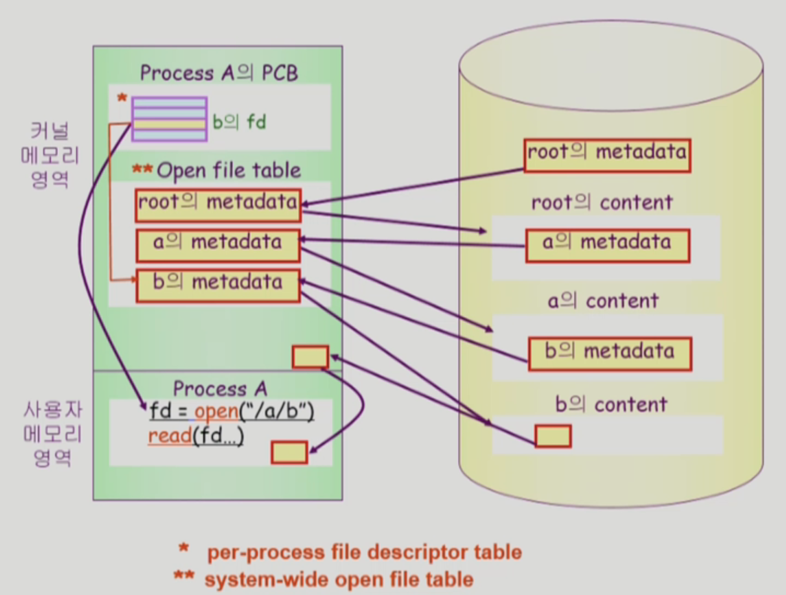
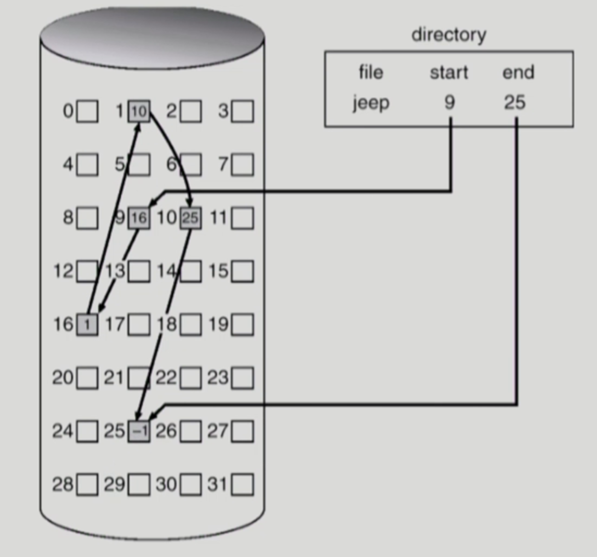
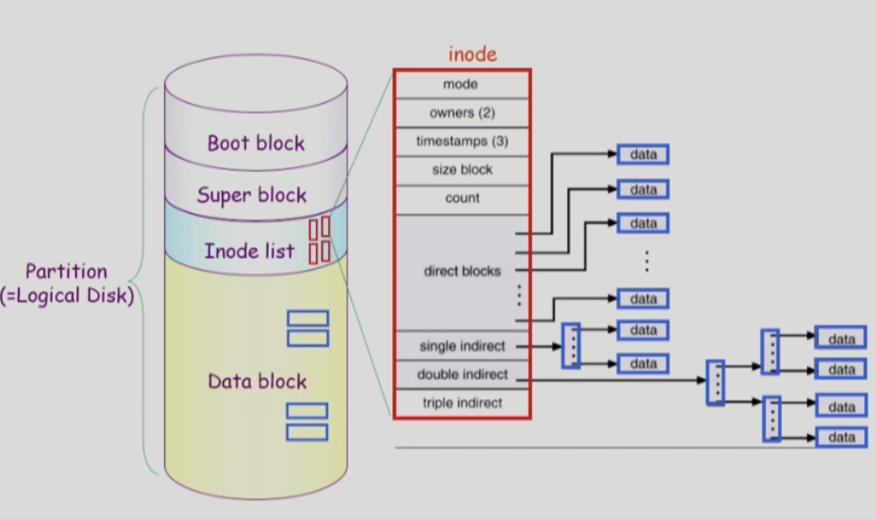
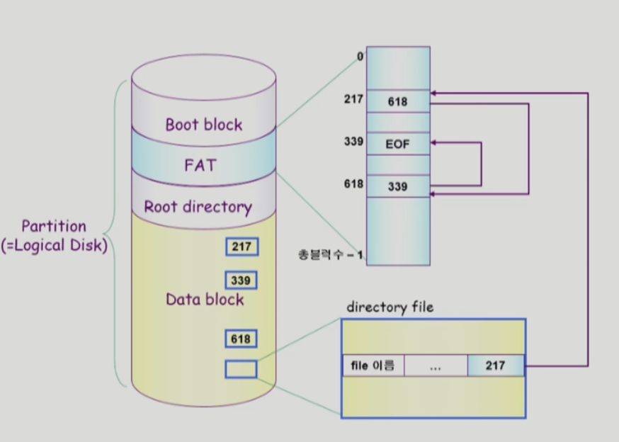
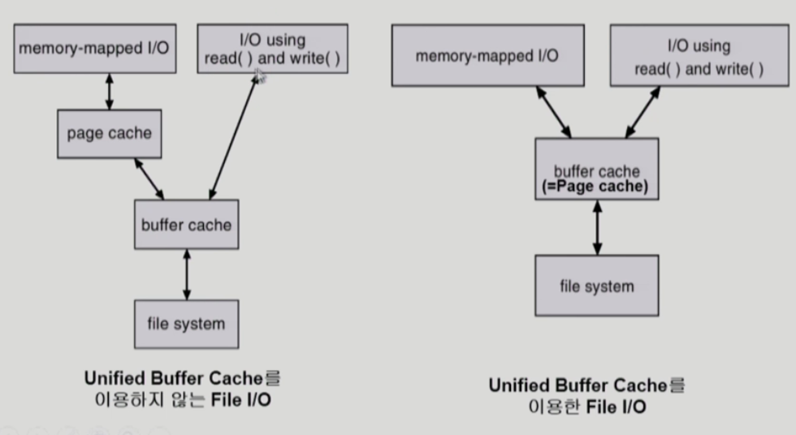

# File System

## File / File System

### File

- 비휘발성의 보조기억장치에 저장(하드디스크)
- 운영체제는 다양한 저장 장치를 file이라는 동일한 논리적 단위로 볼 수 있게 해줌
- operation: create, read, write, reposition(lseek), delete, open, close 등

### File attribute(metadata)

- 파일 자체의 내용이 아니라 파일을 관리하기 위한 각종 정보들
    - 파일 이름, 유형, 저장된 위치, 파일 사이즈
    - 접근 권한(읽기/쓰기/실행), 시간(생성/변경/사용), 소유자 등

### File System

- 운영체제에서 파일을 관리하는 부분
- 파일 및 파일의 메타데이터, 디렉토리 정보 등을 관리
- 파일의 저장 방법 결정
- 파일 보호 등

## Directory and Logical Disk

### Directory

- 파일의 메타데이터 중 일부를 보관하고 있는 일종의 특별한 파일
- 그 디렉토리에 속한 파일 이름 및 파일 attr들
- operation
    - search for a file, create a file, delete a file
    - list a directory, rename a file, traverse the file system

### Partition(=Logical Disk)

- 하나의 (물리적)디스크 안에 여러 파티션을 두는게 일반적
- 여러 개의 물리적인 디스크를 하나의 파티션으로 구성하기도 함
- (물리적)디스크를 파티션으로 구성한 뒤 각각의 파티션에 file system을 깔거나 swapping 등 다른 용도로 사용할 수 있음

## open()

특정 파일의 메타데이터를 여는 것 ( 파일의 내용을 저장하고 있는 포인터도 함께 읽을 수 있음)

🔖 open(”/a/b/c”)

- 디스크로부터 파일 c의 메타데이터를 메모리고 가지고 옴
- 이를 위해서 directory path를 search
    - 루트 오픈 → 파일 a 위치 획득 → a 오픈, read 해서 b의 위치 획득 → 동일하게 b → c 오픈
- directory path를 search에 너무 많은 시간 소요
    - open을 read/write로 별도로 두는 것, 한 번 오픈한 파일은 read/write시 directory search 불필요
- Open file table
    - 현재 오픈된 파일들의 메타데이터 보관소 (in memory)
    - 디스크의 메타데이터보다 몇 가지 정보 추가 (open 한 프로세스의 수, file offset - 파일 어느 위치 접근중인지 표시 → 별도 테이블 필요)
- file descriptor (file handle, file control block)
    - open file table에 대한 위치 정보 (프로세스 별)

마지막에 b의 content에 접근했을 때 해당 content를 바로 사용자 메모리 영역에 저장하지 않고, 커널의 일부분에 저장해두었다가 copy해서 사용자에게 전달한다. 

⇒ 다시 Read하면 다시 disk까지 가는 것이 아니라 저장해둔 content를 전달한다. ⇒ buffer caching

⇒ 메모리에 있든 없든 read를 하면 system call을 통해 CPU제어권이 운영체제로 넘어간다. 그래서 자연스럽게 LRU나 LFU알고리즘을 사용할 수 있다.

각 파일에 대해 누구에게 어떤 유형의 접근(read/write/execution)을 허락할 것인가 ?

## File Protection

### Access Control Matrix

행렬 방식을 사용하면 남는 공간이 많이 생기기 때문에 일반적으로 linkedlist 형태를 사용하지만, 이 또한 overhead가 크다.

- Access Control list: 파일 별로 누구에게 어떤 접근 권한이 있는지 표시
- Capability: 사용자별로 자신이 접근 권한을 가진 파일 및 해당 권한 표시

### ✨ Grouping

- 일반적인 운영체제에서 사용하는 방법
- 전체 user를 owner, group, public의 세 그룹으로 구분
- 각 파일에 대해 세 그룹의 접근 권한 (rwx)를 3비트씩으로 표시

### Password

- 파일마다 password를 두는 방법 (디렉토리 파일에 두는 방법도 가능)
- 모든 접근 권한에 대해 하나의 password: all or nothing
- 접근 권한별 password: 암기 문제, 관리 문제

## File Access Methods

시스템이 제공하는 파일 정보의 접근 방식

### 순차 접근 (sequential access)

카세트 테이프를 사용하는 방식처럼 접근

읽거나 쓰면 offset은 자동적으로 증가

### 직접 접근 (direct access, random access)

LP 레코드 판과 같이 접근하도록 함

파일을 구성하는 레코드를 임의의 순서로 접근할 수 있음

## Allocation of File Data in Disk

직접 접근이 가능한 매체라 하더라도 데이터를 관리하는 방법에 따라 순차접근만 가능한 경우도 있음

### Contiguous Allocation

지속적으로 할당하는 것을 의미하며, 예를 들어 1에서 길이 4를 할당한다고 하면 1, 2, 3, 4이렇게 할당하는 방식을 의미

❌ 단점

- external framentation (사용할 수 없는 공간)
- File grow가 어려움
    - file 생성시 얼마나 큰 hole을 배당할 것인가?
    - grow 가능 vs 낭비 (internal fragmentation - 할당은 되었는데 사용하지 않는 공간)

⭕️ 장점

- Fast I/O
    - 한 번의 seek/rotation으로 많은 바이트 transfer
    - Realtime file용으로, 이미 run 중이던 process의 swapping용
- Direct access (=random access) 가능

### Linked Allocation

연속적으로 배치하는 것이 아니라, 비어있는 곳이면 연속적이지 않더라도 배치 가능

시작 위치만 가지고 있고, 해당 폴더에서 접근하는 것

❌ 단점

- No random access
- Reliability 문제
    - 한 sector가 고장나 pointer가 유실되면 많은 부분을 잃음
- Pointer를 위한 공간이 block의 일부가 되어 공간 효율성을 떨어뜨림
    - 512 bytes/sector, 4bytes/pointer

⭕️ 장점

- external fragmentation 발생 안 함

✔️ 변형

- File-allocation table (FAT) 파일 시스템
    - 포인터를 별도의 파일에 위치에 보관하여 reliability와 공간 효율성 문제 해결

### Indexed Allocation

직접 접근이 가능하도록 인덱스 블록(모든 주소를 저장해놓은 블록)을 적어놓음

⭕️ 장점 

- External fragmentation이 발생하지 않음
- Direct access 가능

❌ 단점

- 아무리 작은 블록이더라도 인덱스를 저장하기 위한 블록이 필요
- small file의 경우 공간 낭비 (실제로 많은 file들이 small)
- Too large file의 경우 하나의 block으로 index를 저장하기에 부족 ⇒ linked scheme(마지막에 또다른 index block을 가리키도록 함), multi-level index 사용하여 해결 가능

## UNIX 파일 시스템 구조

1. Boot block
    
    어떤 파일 시스템이던 가장 먼저 나오는 block, 항상 0번 블럭
    
    부팅에 필요한 정보(bootstrap loader)
    
2. Super block
    
    파일 시스템에 관한 총체적인 정보를 담고 있음
    
3. Inode list
    
    파일 이름을 제외한 파일의 모든 메타 데이터를 저장
    
    디렉토리가 메타데이터를 모두 가지고 있지 않기 때문에, 별도로 빼서 가지고 있는데 그게 Inode list를 의미한다. 
    
    유일하게 파일의 이름과 Inode 번호만 디렉토리가 가지고 있고, 나머지 메타데이터는 Inode가 가지고 있다. ⇒ Inode 번호를 통해 파일의 메타데이터에 접근
    

⇒ unix 파일 시스템은 index allocation을 변형해서 사용하고 있다.

**** 위치 정보**

direct blocks, single indirect, double indirect, triple indirect 4가지로 파일의 위치 정보를 구성함

파일의 크기가 작다면 direct blocks로 충분히 파일의 위치를 구별할 수 있음

파일의 크기가 크다면 indirect(single, double, triple)도 함께 사용함

**대부분의 파일은 크기가 작기 때문에 direct로 접근가능하고, 가끔 존재하는 아주 큰 파일의 경우 indirect로 접근하기 때문에 효율적이라고 할 수 있다.**

## FAT File System

windows 계열이나 모바일에서 사용하는 경우가 많다.

1. Boot block
2. FAT
    - 메타데이터의 일부(위치 정보)를 FAT에 보관하며, 해당 블럭의 다음 블럭의 위치를 담고 있다.
    - 나머지는 모두 directory가 가지고 있음
    - 중요한 정보기 때문에 여러 copy를 가지고 있음

** 217번의 다음 block은 618 → 618의 다음 block 339 → 339의 다음 블록은 EOF(끝) ⇒ **Linked Allocation**을 활용했는데, 실제 블럭에 접근하는 것이 아니라 FAT만 확인하면 다음 block의 위치를 확인할 수 있다. 또한 직접 접근이 가능하다.

## Free Space Management

1. Bit map or bit vector
    1. unix의 경우 data block에 있는 각 번호를 super block에 bit(현 변호가 사용중인지 아닌지)로 저장
    2. 0이면 block free, 1이면 block occupied
    3. 디스크의 부가적인 공간을 필요로 함
    4. 연속적인 n개의 free block을 찾는데 효과적
2. Linked list
    1. 비어있는 block을 모두 링크로 연결
    2. 연속적인 가용공간을 찾는 것이 쉽지 않음
    3. 공간의 낭비가 없다.
3. Grouping
    1. linked list 방법의 변형
    2. 연속적인 빈 블럭을 찾는 것에는 효과적이지 않음
    3. 첫번째 free block이 n개의 pointer를 가짐 ⇒ 각 포인터를 이어 linked list처럼 구현
4. Counting
    1. 프로그램들이 종종 여러 개의 연속적인 block을 할당하고 반납한다는 성질에 착안
    2. 단지 포인터가 빈 블럭을 가리키기만 하는 것이 아니라, 거기서 몇 개가 비어있다는 것을 함께 나타냄

## Directory Implementation

directory: 그 하위에 있는 파일들의 메타데이터를 관리하는 특별한 파일

### Linear list

- file name, file의 metadata의 list
- metadata의 크기는 고정
- 구현은 간단하지만, 디렉토리 내에 파일이 있는지 찾기 위해서는 linear search 필요 (time-consuming)

### Hash Table

- linear list + hashing
- 파일의 이름에 hash 함수를 적용하여 hash함수의 결과 값이 특정 범위 안으로 적용 ⇒ 그 숫자에 파일의 metadata를 저장
- hash table은 file nam을 이 파일의 linear list의 위치로 바꾸어 줌
- search time을 없앰
- Collision 발생 가능 ⇒ 겹침이 가능한데, 이건 자료구조 상 해결해야 할 문제

### File의 metadata 보관 위치

- 디렉토리 내에 직접 보관
- 디렉토리에는 포인터를 두고 다른 곳에 보관
    - 유닉스의 경우 Inode, FAT 파일시스템의 경우 FAT

### Long file name의 지원

- file name, file의 metadata의 list에서 각 entry는 일반적으로 고정 크기
- file name이 고정 크기의 entry길이보다 길어지는 경우 entry의 마지막 부분에 이름의 뒷부분이 위치한 곳의 포인터를 두는 방법
- 이름의 나머지 부분은 directory file의 일부에 존재

## VFS와 NFS

### Virtual File System(VFS)

서로 다른 다양한 file system에 대해 동일한 시스템 콜 인터페이스 (API)를 통해 접근할 수 있게 해주는 OS layer

### Network File System(NFS)

분산 시스템에서는 네트워크를 통해 파일이 공유될 수 있음

NFS는 분산 환경에서의 대표적인 파일 공유 방법임

## Page Cache와 Buffer Cache

### Page Cache(virtual memory 관점)

clock algorithm 사용

Virtual memory의 paging system에서 사용하는 page frame을 caching의 관점에서 설명하는 용어

Memory-Mapped I/O를 쓰는 경우 file의 I/O에서도 page cache 사용

프로세스의 주소 공간을 공유하는 페이지가 swap area에 내려와있는지 page cache에 올라와있는지 ⇒ page 단위

### Memory-Mapped I/O(File)

File의 일부를 virtual memory에 mapping 시킴

매핑시킨 영역에 대한 메모리 접근 연산은 파일의 입출력을 수행하게 함

프로세스의 주소 공간 중 일부를 파일에 매핑 해둠 ⇒ 파일 입출력 가능하도록

### Buffer Cache (file system 관점)

파일 시스템을 통한 I/O 연산은 메모리의 특정 영역인 buffer cache 사용

file 사용의 locality 사용

모든 프로세스가 공용으로 사용

Replacement algorithm 필요

### Unified Buffer Cache

최근 OS에서는 기존의 buffer cache가 page cache에 통합됨

미리 공간 구분을 하지 않고 page 단위로 구분을 하며, 필요할 때 파일 입출력의 용도로 필요할 경우 buffer cache의 용도로 사용하고, 프로세스의 주소 공간 중에 페이지가 필요하면 page cache의 용도로 사용한다.

**필요할 때마다 할당하여 쓴다.**

📍 왼쪽

기존의 File I/O ⇒ page cache와 buffer cache를 따로 사용

처음에는 m-mapped을 하는 system call을 한 뒤 자신의 주소공간 중 일부를 file에 매핑 ⇒ page cache에 copy (file에 mapped 된 내용) 

**이미 메모리에 올라온 내용에 대해서는 커널에 접근하지 않고 자신이 직접 자신의 메모리에 접근하듯이 읽고 쓸 수 있기 때문에 memory-mapped I/O를 사용함**

📍 오른쪽

read, write에 접근하기 위해서는 이미 메모리에 올라가 있는 내용에 대해서는 buffer cache에 접근하고, 없는 내용에 대해서는 커널에 접근하여 메모리에 올림

memory-mapped I/O에서는 처음에 운영체제에게 자신의 주소영역 중 일부를 파일에 매핑하는 단계를 거치고 나면 사용자 주소영역에 page cache가 매핑이 되며, copy해서 올라가는 것이 아닌 매핑이 되어 page cache에 읽고 쓰고가 되는 것

⇒ 충돌 문제 발생 가능성 있음