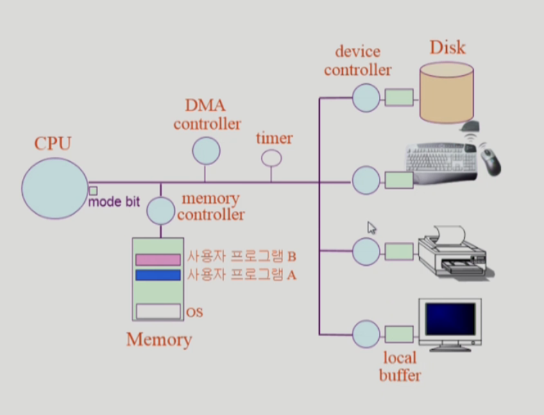
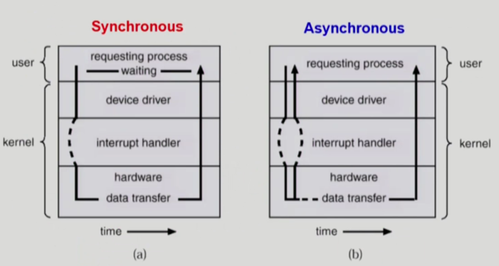
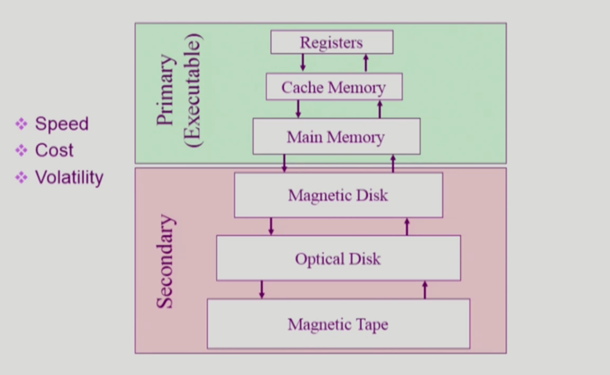
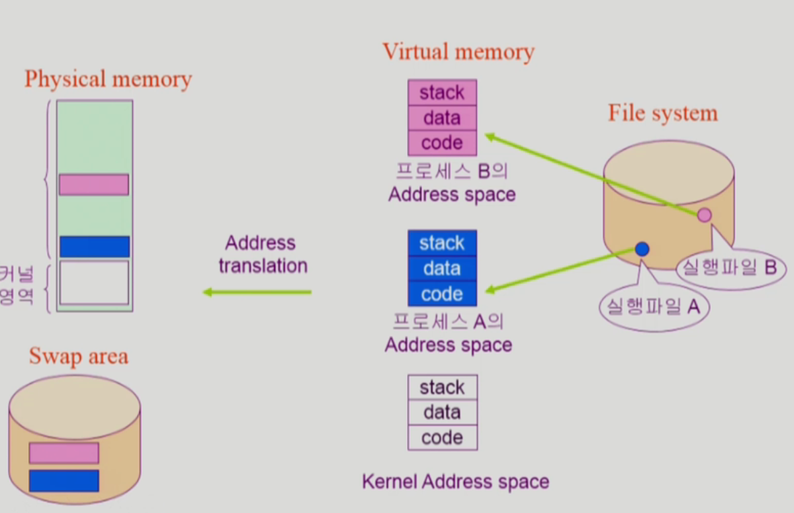
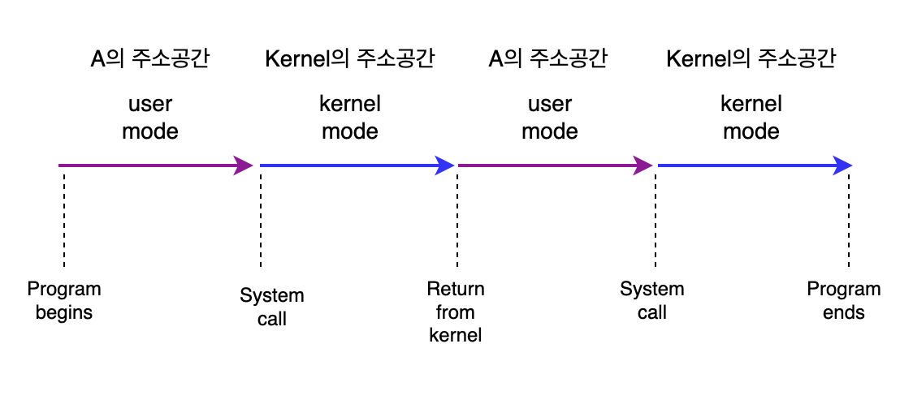

# System Structure

## 컴퓨터 시스템 구조

- Memory: CPU의 작업 공간
- CPU: Memory에서 instruction을 실행하는 역할(I/O 디바이스에 직접적으로 접근하지 않음) ⇒ 각 controller에 지시를 해서 실행하게 한다.
    - CPU register 중 메모리 주소를 가리키고 있는 program count register 에서 instruction을 하나 읽어와 실행한다.
    - program count register는 다음 주소를 가리킨다.
    - 항상 순차적으로 실행되는 것은 아니기 때문에, 다른 instruction을 만나면 멀리 있는 instruction을 실행할 수도 있다.
    - 다음 instruction을 확인하기 전, interrupt line을 확인한다. ⇒ 인터럽트 백터에서 확인한다.
- Timer: 특정 프로그램이 CPU를 독점하는 것을 막기 위한 역할
    
    ⇒ 처음에는 운영체제가 CPU를 가지고 있다가, 사용자 프로그램이 실행되면 CPU를 넘겨주는데 timer에 값을 세팅해서 넘겨준다. 사용자 프로그램은 instruction을 실행하다 세팅된 시간이 지나면 interrupt 당한다. instruction이 하나 끝나고 나면 CPU에서 interrupt line을 체크해서 interrupt가 된 것이 있는지 확인한다. 
    

### Mode bit

CPU를 운영체제가 가지고 있느냐, 사용자 프로그램이 가지고 있느냐를 표시해주는 것

사용자 프로그램의 잘못된 수행으로 다른 프로그램 및 운영체제에 피해가 가지 않도록 하기 위한 보호 장치

<aside>
   
    💡
    1 사용자 모드: 사용자 프로그램 수행
    0 모니터 모드(=커널 모드, 시스템 모드): OS 코드 수행

</aside>

✔️ 0일 때는 메모리 접근 뿐만 아니라 모든 일을 다 수행할 수 있도록 설정되어 있지만, 1일 때는 제한된 instruction만 실행할 수 있도록 되어 있다. (보안)

✔️ Interrupt나 Exception이 들어오면 mode bit이 자동으로 1에서 0으로 변환되며, CPU 제어권이 운영체제로 변경된다.

### Timer

- 정해진 시간이 흐른 뒤 운영체제에게 제어권이 넘어가도록 인터럽트를 발생시킴
- 타이머 값이 0이 되면 타이머 인터럽트 발생
- CPU를 특정 프로그램이 독점하는 것으로부터 보호
- 현재 시간을 계산하기 위해서도 사용하며, time sharing을 구현하기 위해서도 이용

### Device Controller

- I/O 장치를 관리하는 일종의 작은 CPU (작은 CPU는 local buffer에만 접근 가능)
- 데이터를 저장하는 local buffer를 가지고 있다. (데이터를 메모리에 넘겨주거나, 출력을 위한 local buffer)
- 제어 정보를 위한 register (파일에 저장하라는 명령 같은 것)

🔖 device driver(장치구동기) : OS 코드 중 각 장치별 처리루틴 ⇒ software

🔖 device controller(장치제어기) : 각 장치를 통제하는 일종의 작은 CPU ⇒ hardware

### DMA

CPU는 본인의 일을 하고 있고, local buffer의 작업이 끝나면 DMA가 직접 local buffer의 내용을 메모리로 복사, 작업이 끝나면 DMA가 직접 interrupt를 걸어 CPU가 직접 여러번 interrupt 당하는 빈도수를 줄여주는 역할을 한다.

### I/O

- 모든 입출력 명령은 특권 명령이기 때문에 운영체제를 통해서만 I/O 요청 가능

<aside>

    💡 사용자 프로그램이 I/O를 하는 방법
    1. system call : 사용자 프로그램이 운영체제에게 I/O 요청
    2. trap을 활용하여 인터럽트 벡터의 특정 위치로 이동
    3. 제어권이 인터럽트 벡터가 가리키는 인터럽트 서비스 루틴으로 이동
    4. 올바른 I/O 요청인지 확인 후 I/O 수행
    5. I/O 완료 시 제어권을 시스템콜 다음 명령으로 옮김

</aside>

### 인터럽트

인터럽트 당한 시점의 레지스터와 program counter를 save한 후 CPU의 제어를 인터럽트 처리 루틴에 넘긴다.

I/O를 요청할 때는 소프트웨어 인터럽트를 통해서 요청하고, I/O가 끝났을 때는 하드웨어 인터럽트를 통해서 알려준다.

현대의 운영체제는 인터럽트에 의해 구동된다. 

✔️ interrupt (하드웨어 인터럽트): 하드웨어가 발생시킨 인터럽트

✔️ Trap (소프트웨어 인터럽트)

- exception: 프로그램이 오류를 범한 경우
- System call: 프로그램이 커널 함수를 호출하는 경우

🔖 인터럽트 관련 용어

✔️ 인터럽트 벡터: 해당 인터럽트의 처리 루틴 주소를 가지고 있음

✔️ 인터럽트 처리 루틴(인터럽트 핸들러): 해당 인터럽트를 처리하는 커널 함수

## 동기식 입출력과 비동기식 입출력

### 동기식 입출력 (synchronous I/O)

- I/O 요청 후 입출력 작업이 완료된 후에야 제어가 사용자 프로그램에 넘어감

### 비동기식 입출력(asynchronous I/O)

- I/O 가 시작된 후 입출력 작업이 끝나기를 기다리지 않고 제어가 사용자 프로그램에 즉시 넘어감

⇒ 두 경우 모두 I/O의 완료는 인터럽트로 알려줌

### DMA(Direct Memory Access)

- 빠른 입출력 장치를 메모리에 가까운 속도로 처리하기 위해 사용
- CPU의 중재 없이 device controller가 device의 buffer stoarge의 내용을 메모리에 block 단위로 직접 전송
- 바이트 단위가 아니라 block 단위로 인터럽트를 발생시킴

## 저장장치 계층 구조

⇒ 위로 올라갈수록 빠르고 비싸며, 휘발성이 높다.

CPU에 직접 접근하려면 바이트 단위 접근이 가능해야 하는데, DRAM은 바이트 단위 접근이 가능하기 때문에 executable 하다.

## 프로그램의 실행 (메모리 load)

프로그램을 실행시키게 되면 독자적인 메모리 주소 공간(가상 메모리)이 생김 ⇒ 물리적인 메모리에 주소변환을 해서 실행시킴

### 커널

| code | data | stack |
| --- | --- | --- |
| 커널 코드 (시스템 콜, 인터럽트 처리 코드, 자원 관리를 위한 코드, 편리한 서비스 제공을 위한 코드) | PCB(Process A), PCB(Process B) CPU, MEM, DISK | ProcessA의 커널 스택, ProcessB의 커널 스택 |

## 사용자 프로그램이 사용하는 함수

### 사용자 정의 함수

자신의 프로그램에서 정의한 함수

### 라이브러리 함수

자신의 프로그램에서 정의하지 않고 갖다 쓴 함수

자신의 프로그램의 실행 파일에 포함되어 있다.

### 커널 함수

운영체제 프로그램의 함수

커널 함수의 호출 = 시스템 콜

## 프로그램의 실행

