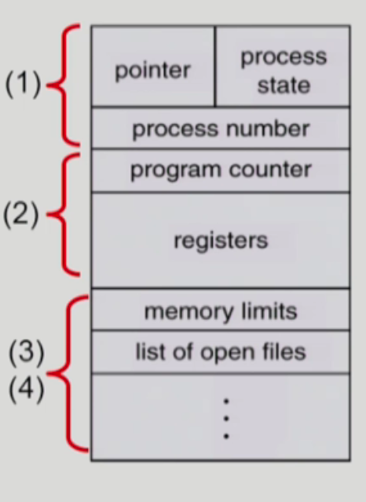
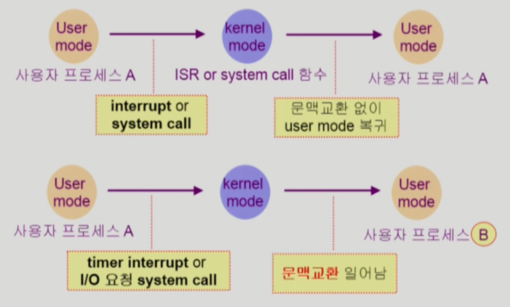

# Process

## 개념

실행 중인 프로그램

## 프로세스의 문맥(context)

⇒ 프로세스가 현재 어떤 상황에 있는지 확실하게 알 수 있다.

- CPU 수행 상태를 나타내는 하드웨어 문맥
    - Program Counter
    - 각종 register
    - 프로세스의 주소 공간
    - code, data, stack
- 프로세스 관련 커널 자료 구조
    - PCB(Process Control Block)
    - Kernel Stack

## 프로세스의 상태

### Running

CPU를 잡고 instruction을 수행중인 상태

### Ready

CPU를 기다리는 상태 (메모리 등 다른 조건은 모두 만족하고)

### Blocked(wait, sleep)

CPU를 주어도 당장 instruction을 수행할 수 없는 상태

Process 자신이 요청한 event(예: I/O)가 즉시 만족되지 않아 이를 기다리는 상태

예 ) 디스크에서 파일을 읽어와야 하는 경우

### Suspended (stopped) ⇒ Medium-term scheduler에서 추가된 개념

외부적인 이유로 프로세스 수행이 정지된 상태

프로세스는 통째로 디스크에 swap out 된다.

예 ) 사용자가 프로그램을 일시 정지한 경우 (break key)

사용자가 여러 이유로 프로세스를 잠시 중단시킴 (메모리에 너무 많은 프로세스가 올라와 있을 때)

📍 Blocked : 자신이 요청한 event가 만족되면 Ready

📍 Suspended : 외부에서 resume 해줘야 Active

### New

프로세스가 생성 중인 상태

### Terminated

수행이 끝난 상태

✔️ 운영체제 커널이 Data 영역에 queue를 만들어놓고 프로세스의 상태를 바꿔가며 ready 상태에 있는 프로그램에 CPU 제어권을 주고 blocked 된 프로그램에는 CPU 할당을 제어함으로써 CPU와 프로그램을 관리한다.

## Process Control Block(PCB)

운영체제가 각 프로세스를 관리하기 위해 프로세스 당 유지하는 정보 (구조체로 유지)

### 1. OS가 관리상 사용하는 정보

Process State, Process ID

scheduling infomation, priority

### 2. CPU 수행 관련 하드웨어 값

Program counter, registers

### 3. 메모리 관련

Code, data, Stack의 위치 정보

### 4. 파일 관련

Open file description

## 문맥 교환(context switch)

CPU를 한 **프로세스에서 다른 프로세스로 넘겨주는 과정**

CPU가 다른 프로세스에 넘어갈 때 운영체제는 아래와 같은 과정을 수행한다.

⇒ CPU를 내어주는 프로세스의 상태를 그 프로세스의 PCB에 저장

⇒ CPU를 새롭게 얻는 프로세스의 상태를 PCB에서 읽어옴

✔️ System call이나 interrupt 발생시 반드시 context switch가 일어나는 것은 아님

System call : 프로세스가 본인이 필요해서 운영체제에 요청할 때

interrupt : 컨트롤러와 같은 장치가 CPU에 정보를 전달할 목적으로 요청할 때

⇒ 위 두 가지가 발생하면 CPU 제어권이 **운영체제에서 사용자**로 넘어가게 됨

⇒ 단순히 제어권이 넘어가는 것은 context switch가 아니고, 제어권이 넘어가면서 실행되는 프로세스가 변경되게 되면 context switch가 발생했다고 한다.

첫 번째의 경우에도 CPU 수행 정보 등 context의 일부를 PCB에 save 해야 하지만 문맥 교환을 하는 두 번째의 경우 그 부담이 훨씬 큼

## 프로세스를 스케줄링 하기 위한 큐

### Job queue

현재 시스템 내에 있는 모든 프로세스의 집합

### Ready queue

현재 메모리 내에 있으면서 CPU를 잡아서 실행되기를 기다리는 프로세스의 집합

### Device queues

I/O device의 처리를 기다리는 프로세스의 집합

## 스케줄러 (scheduler)

### Long-term scheduler (job scheduler)

**시작 프로세스 중 어떤 것들을 ready queue로 보낼지 결정, 메모리에 몇 개의 프로그램을 올려 놓을지 결정**

프로세스에 memory를 주는 문제

degree of Multiprogramming(메모리에 올라간 프로그램의 수) 을 제어

time sharing system에는 보통 장기 스케줄러가 없음 (무조건 ready) ⇒ 생겨난 것이 Medium-term scheduler

### Short-term scheduler (단기 스케줄러 or CPU scheduler)

어떤 프로세스를 다음 번에 running 시킬지 결정

프로세스에 CPU를 주는 문제

충분히 빨라야 함 (millisecond 단위)

### Medium-term scheduler(Swapper)

여유 공간 마련을 위해 프로세스를 통째로 메모리에서 디스크로 쫓아냄

프로세스에게서 memory를 뺏는 문제

degree of Mulitprogramming을 제어

## Thread ( lightweight process )

프로세스 내부에 CPU 수행 단위가 여러개 있는 경우

### 구성 (CPU 수행과 관련된 부분)

program counter

register set

stack space

### Thread가 동료 thread와 공유하는 부분 (=task)

code section

data section

OS resources

### 장점

동일한 일을 수행하는 다중 스레드가 협력하여 높은 처리율(throughput)과 성능 향상을 얻을 수 있다.

1. 응답성 (Responsiveness)
    
    하나의 서버스레드가 blocked(waiting) 상태인 동안에도 동일한 태스크 내의 다른 스레드가 실행(running)되어 빠른 처리가 가능하다. ⇒ 빠른 응답성
    
2. 자원 공유 (Resource Sharing)
    
    코드, 데이터, 각종 자원을 공유
    
3. 경제성 (Economy)
    
    context switch의 경우 비용이 많이 들어가지만, CPU을 switching 하는 것이 overhead가 적다.
    
4. Utilization of MP Architectures
    
    스레드를 사용하면 병렬성을 높일 수 있다. (CPU가 여러 개 있는 곳에서 얻을 수 있는 장점)
    

### 스레드의 종류

kernel threads는 커널의 지원을 받아서 만드는 스레드이기 때문에 kernel이 그 존재를 알고 있기만, user threads는 유저 내부에서 만들어지는 스레드이기 때문에 kernal이 해당 스레드의 존재를 알 수 없다.