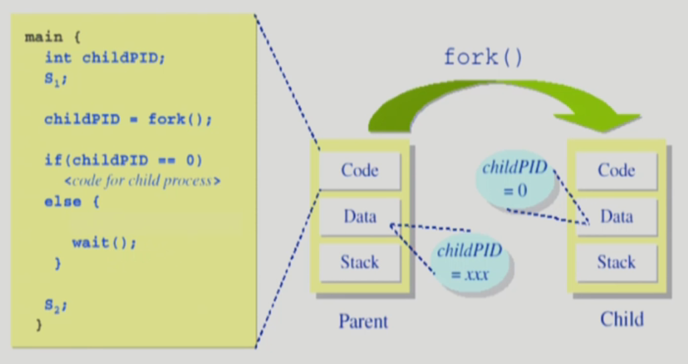

# 프로세스 관리
## 프로세스의 생성

**Copy-on-write(COW)**

자식 프로세스가 부모 프로세스의 내용을 계속 공유하다가 다른 부분 생겨 write가 발생했을 떄, 새로운 페이지를 복사해서 write 함으로써 overhead를 줄이는 방식

1. 부모 프로세스(Parent process)가 자식 프로세스(children process) 생성 (복제)
    1. 자식은 부모의 주소 공간을 복사 (binary and OS data)
    2. 자식은 그 공간에 새로운 프로그램을 돌림
    
    예 ) fork()를 통해 새로운 프로세스를 생성하고, exec()을 통해 새로운 프로그램을 메모리에 올림
    
2. 프로세스 트리 (계층 구조) 형성
3. 프로세스는 자원을 필요로 함
    1. 운영체제로부터 받음
    2. 부모와 공유
4. 자원의 공유
    1. 부모와 자식이 모든 자원을 공유하는 모델
    2. 일부를 공유하지 않는 모델
    3. 전혀 공유하지 않는 모델
    
    ⇒ 일반적으로 프로세스가 생성되고 나면 별개의 존재로 보고 경쟁 상대가 되어 자원을 공유하지 않는 경우가 더 많다.
    
5. 수행 (execution)
    1. 부모와 자식은 공존하며 수행되는 모델
    2. 자식이 종료(terminate) 될 때까지 부모가 기다리는(wait) 모델

## 프로세스 종료

1. 프로세스가 마지막 명령을 수행한 후 운영체제에게 이를 알려줌(**exit**)
    1. 자식이 부모에게 output data를 보냄 (via wait)
    2. 프로세스의 각종 자원들이 운영체제에게 반납됨
2. 부모 프로세스가 자식의 수행을 종료시킴 (**abort**)
    1. 자식이 할당 자원의 한계치를 넘어섬
    2. 자식에게 할당된 테스크가 더이상 필요하지 않음
    3. 부모가 종료하는 경우
        
        운영체제는 부모 프로세스가 종료하는 경우 자식이 더이상 수행되도록 두지 않는다. ⇒ 단계적인 종료
        

## exec() 시스템 콜

새로운 프로그램으로 메모리를 완전히 변경하는 것

```c
int main() 
{
	int pid;
	pid = fork();
	if (pid == 0) 
	{
		printf("\n Hello, I am child! Now I'll run date \n");
		execlp("/bin/date", "/bin/date", (char *)0);
	}
	else if (pid > 0)
		printf("\n Hello, I am parent \n");
}
```

위의 경우 main 함수를 실행하고, date라는 새로운 프로그램을 실행하고 끝내는 것 ! 다시 돌아오지는 못한다.

## wait() 시스템 콜

프로세스A가 wait() 시스템 콜을 호출하면, 커널은 child가 종료될 때까지 프로세스A를 sleep 시킨다(block 상태), child process가 종료되면 커널은 프로세스A를 깨운다. (ready 상태)

⇒ 자식이 종료(terminate)될 때까지 부모가 기다리는(wait) 모델



## exit() 시스템 콜 (프로세스 종료)

### 자발적 종료

마지막 statement 수행 후 exit() 시스템 콜을 통해 프로그램에 명시적으로 적어주지 않아도 main 함수가 리턴되는 위치에 컴파일러가 넣어줌

### 비자발적 종료

부모 프로세스가 자식 프로세스를 강제 종료시킴

- 자식 프로세스가 한계치를 넘어서는 자원 요청
- 자식에게 할당된 테스크가 더 이상 필요하지 않음 (더 이상 시킬 일이 없을 때)

키보드로 kill, break 등을 친 경우

부모가 종료하는 경우 ⇒ 부모 프로세스가 종료하기 전에 자식들이 먼저 종료됨

## 프로세스 간 협력

### 독립적 프로세스

프로세스는 각자의 주소 공간을 가지고 수행되므로 원칙적으로 하나의 프로세스는 다른 프로세스의 수행에 영향을 미치지 못함

### 협력 프로세스

프로세스의 협력 매커니즘을 통해 하나의 프로세스가 다른 프로세스의 수행에 영향을 미칠 수 있음

### 프로세스 간 협력 메커니즘 (IPC: Interprocess Communication)

1. 메시지를 전달하는 방법
    
    message passing : 커널을 통해 메시지 전달
    
    ⭕️ Direct Communication (통신하려는 프로세스의 이름을 명시적으로 표시)
    
    ⭕️ Indirect Communication (메일박스 또는 포트를 통해 메시지를 간접 전달)
    
2. 주소 공간을 공유하는 방법
    
    shared memory: 서로 다른 프로세스 간에도 일부 주소 공간을 공유하게 하는 shared memory 메커니즘이 있음
    