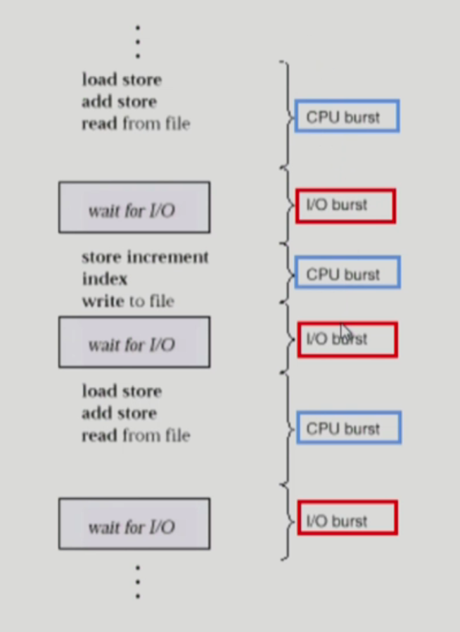
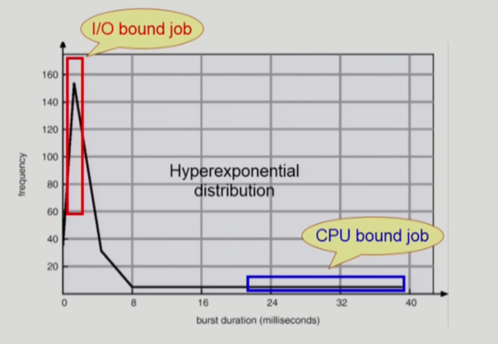
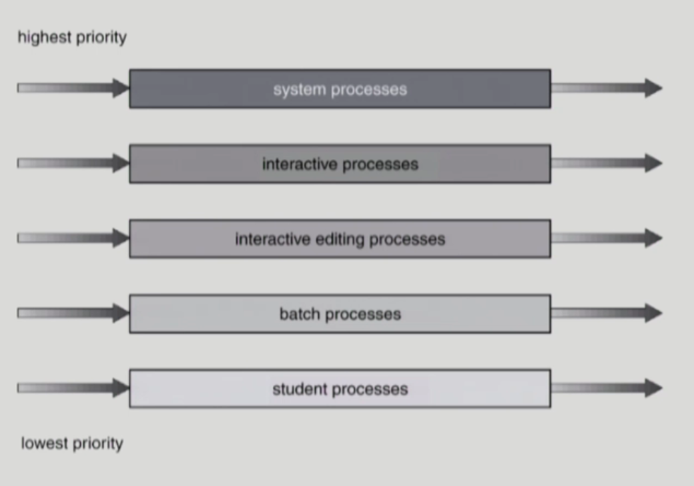
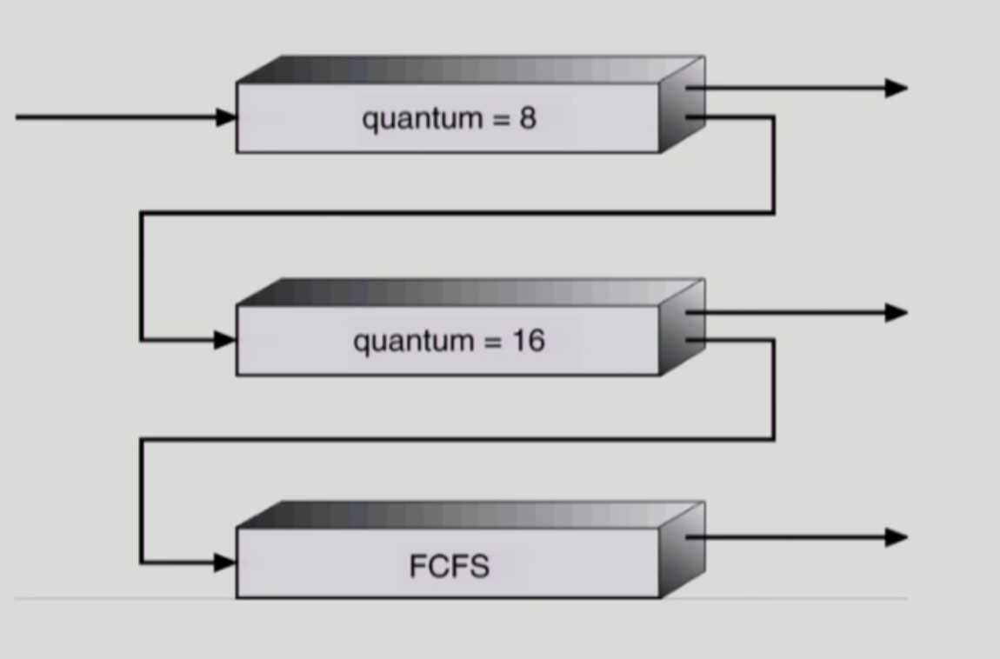

# CPU Scheduling

## CPU와 I/O Bursts in Program Execution

CPU burst와 I/O burst가 번갈아가면서 일어난다.

프로그램의 종류에 따라 길이나 빈도가 다르다.

## CPU-burst Time의 분포

**I/O bound job**

CPU를 짧게 쓰고 중간에 I/O가 끼어드는 작업

CPU를 잡고 계산하는 시간보다 I/O에 많은 시간이 필요한 job

many short CPU bursts

**CPU bound job**

CPU만 오래토록 쓰는 작업

few very long CPU bursts

✔️ I/O bound job이 CPU를 많이 쓰는 것이 아니라, CPU bound job이 CPU를 많이 쓰지만 빈도수는 I/O bound job 이 많다는 의미로 그래프를 해석할 수 있다.

✔️ 여러 종류의 Job(=process)가 섞여있기 때문에 CPU 스케줄링이 필요하다.

✔️ Interactive job에게 적절한 response 제공을 요망

✔️ CPU와 I/O 장치 등 시스템 자원을 골고루 효율적으로 사용

## CPU Scheduler & Dispatcher

### CPU scheduler

Ready 상태의 프로세스 중에서 이번에 CPU를 줄 프로세스를 고른다.

### Dispatcher

CPU 제어권을 CPU scheduler에 의해 선택된 프로세스를 넘긴다.

이 과정을 context switch(문맥 교환)이라고 함

### 필요한 경우

1. Running → Blocked ( I/O 요청하는 시스템 콜 )
2. Running → Ready ( 할당시간만료로 timer interrupt )
3. Blocked → Ready ( I/O 완료 후 인터럽트)
4. Terminate

⇒ 1번과 4번의 스케줄링은 **nonpreemptive** (강제로 빼앗지 않고 자진 반납)

⇒ 나머지는 **preemptive** (강제로 빼앗음)

## Scheduling Criteria (성능 척도)

### 1. CPU utilization(이용률) → 시스템 입장

전체 시간 중 CPU가 일한 시간

### 2. Throughput(처리량) → 시스템 입장

주어진 시간 내에 얼마나 많은 일을 처리했는가

### 3. Turnaround time(소요시간, 반환시간) → 프로그램 입장

CPU를 **기다리는 시간부터 반환할 때**까지의 시간

### 4. Waiting time(대기시간) → 프로그램 입장

CPU를 쓰기 위해 기다리는 시간

### 5. Response time(응답시간) → 프로그램 입장

ready queue에 들어와서 **처음으로** CPU를 얻기까지 걸린 시간

## 스케쥴링 알고리즘

### 1. FCFS (First-Come First-Served)

먼저 온 순서대로 처리하는 것

가장 처음의 프로세스가 있는지에 따라서 전체 시간에 영향을 많이 받음

✔️ Convoy effect : 긴 프로세스에 의해서 짧은 프로세스가 오랜시간 기다려야하는 효과

### 2. SJF (Shortest-Job-Frist)

각 프로세스의 다음번 CPU burst time을 가지고 스케줄링에 활용

CPU burst time이 가장 짧은 프로세스를 제일 먼저 스케줄 하는 것

✔️ Nonpreemptive

일단 CPU를 잡으면 이번 CPU burst가 완료될 때까지 CPU를 선점 당하지 않음

✔️ Preemptive

현재 수행중인 프로세스의 남읜 burst time보다 더 짧은 CPU burst을 가지는 새로운 프로세스가 도착하면 CPU를 빼앗김 ⇒ Shortest-Remaining-Time-First(SRTF)

**OPTIMAL ⇒ 주어진 프로세스에 대해 minimum average waiting time을 보장 (preemptive)**

**🔖 두 가지 문제점**

1. 극단적으로 짧은 프로세스를 원하기 때문에 시간이 긴 프로세스는 영원히 실행되지 못할 수도 있다.
2. CPU 사용시간을 미리 알 수 없다. (과거에 어떻게 사용했는지를 보고 예측(추정)할 수 있다. )

### 3. Priority Scheduling

우선순위가 제일 높은 프로세스에게 CPU를 주는 것

정수 값으로 우선순위를 나타내고, 작은 숫자일수록 우선순위가 높다.

✔️ Nonpreemptive

더 높은 우선순위의 프로세스가 도착할 때 CPU를 빼앗을 수 없는 것

✔️ Preemptive

더 높은 우선순위의 프로세스가 도착할 때 CPU를 빼앗는 것

**🔖 문제점**

Starvation(기아 현상) : 우선순위가 낮은 프로세스가 영원히 CPU를 얻지 못할 수도 있다.

⭕️ **해결방법**

Aging: 우선순위가 낮은 프로세스라고 해도 오래 기다리게 되면 우선순위를 높여주는 것

### 4. Round Robin(RR)

현대적인 컴퓨터 시스템에서 사용하는 CPU 스케줄링

⭕️ **응답시간이 빨라진다는 것이 가장 큰 장점**

각 프로세스는 동일한 크기의 할당 시간(time quantum)을 가짐

할당시간이 지나면 프로세스는 preempted 당하고 ready queue의 제일 뒤에 가서 다시 줄을 선다.

n개의 프로세스가 ready queue에 있고 할당 시간이 q time unit인 경우 각 프로세스는 최대 q time unit 단위로 CPU 시간의 1/n을 얻는다 

⇒ 어떤 프로세스도 (n - 1)q time unit 이상 기다리지 않는다.

⇒ q라는 time quantum을 짧게 잡으면 조금만 기다려도 CPU를 할당 받을 수 있다.

⇒ CPU를 사용하려는 시간이 길면 대기 시간도 길어지고, CPU를 사용하려는 시간이 짧으면 대기 시간도 짧아진다.

✔️ q large → FCFS

✔️ q small → context switch 오버헤드가 커진다.

⇒ 적당한 규모의 q를 주는 것이 바람직하다. (10 ~ 100 milliseconds)

✔️ 일반적으로 SJF보다 average turnaround time 이 길지만 **response time은 더 짧다.**

### 5. Multilevel Queue

1. Ready Queue를 여러 개로 분할
    1. foreground (interactive)
    2. background (batch - no human interaction)
2. 각 큐는 독립적인 스케줄링 알고리즘을 가짐
    1. foreground - RR (사람과 interaction이기 때문에)
    2. background - FCFS (CPU와 통신 → 먼저 온 순서대로)
3. 큐에 대한 스케줄링이 필요
    1. Fixed priority scheduling
        
        우선순위 높은 줄이 비어있을 때만 남은 우선순위에게 가는 것 ⇒ starvation 가능성
        
    2. Time slice
        
        각 큐에 CPU 비율을 적절하게 할당
        

### 6. Multilevel Feedback Queue

프로세스가 다른 큐로 이동 가능

처음 들어오는 queue는 가장 우선 순위가 높은 queue에 할당 ⇒ 아래로 갈 수록 round robin의 할당 시간을 늘림 ⇒ 가장 아래 queue는 FCFS 방식을 활용

할당 시간이 맨 위의 queue에서 끝나게 되면 아래 queue로 강등되게 되고, 해당 시간내에 처리가 되지 않으면 더 아래 queue로 강등 ⇒ 할당 시간은 더 받게 되지만 위의 큐를 기다려야 하고, 우선순위는 낮아짐

## Multiple-Processor Scheduling

CPU가 여러 개인 경우 스케줄링은 더욱 복잡해진다.

### Homogeneous Processor인 경우

Queue에 한 줄로 세워서 각 프로세스가 알아서 꺼내가게 할 수 있다.

반드시 특정 프로세서에서 수행되어야 하는 프로세스가 있는 경우에는 문제가 더 복잡해진다.

### Load sharing

일부 프로세서에 job이 몰리지 않도록 부하를 적절히 공유하는 매커니즘 필요

별개의 큐를 두는 방법 vs 공동 큐를 사용하는 방법

### Symmetric Multiprocessing (SMP)

각 프로세서가 각자 알아서 스케줄링 결정

### Asymmetric Multiprocessing

하나의 프로세서가 시스템 데이터의 접근과 공유를 책임지고 나머지 프로세서는 거기에 따름

## Real-Time Scheduling

정해진 시간 안에 반드시 실행되어야 하는 것

### Hard real-time systems

정해진 시간 안에 반드시 끝내도록 스케줄링해야 함

### Soft real-time computing

일반 프로세스에 비해 높은 priority를 갖도록 해야 함

## Thread Scheduling

### Local Scheduling

User level thread의 경우 사용자 수준의 thread library에 의해 어떤 thread를 스케줄할지 결정

OS가 하는 것이 아니라 사용자 프로세스가 직접 어느 스레드에게 CPU를 줄 지 결정하는 것

### Global Scheduling

Kernel level thread의 경우 일반 프로세스와 마찬가지로 커널의 단기 스케줄러가 어떤 thread를 스케줄할지 결정

## Algorithm Evaluation (알고리즘 평가 방법)

### 1. Queueing models

이론적인 방법

확률 분포로 주어지는 arrival rate와 service rate 등을 통해 각종 performance index 값을 계산

### 2. Implementation (구현) & Measurement (성능 측정)

**실제 시스템**에 알고리즘을 구현하여 실제 작업(workload)에 대해서 성능을 측정 비교

### 3. Simulation (모의 실현)

알고리즘을 모의 프로그램으로 작성후 trace(시뮬레이션 프로그램에 input으로 들어갈 데이터)를 입력으로 하여 결과 비교