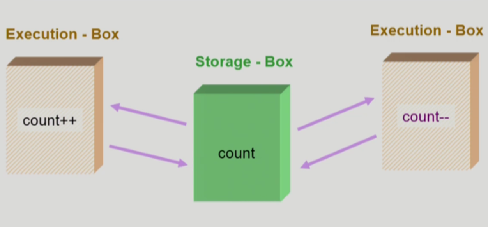
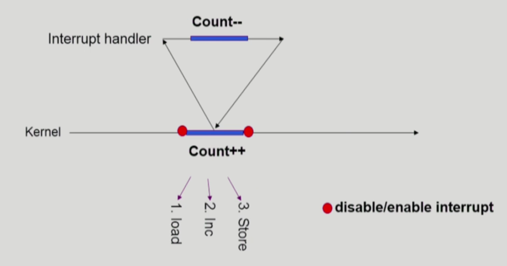
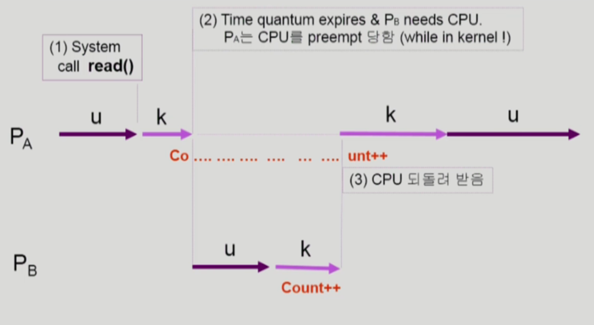
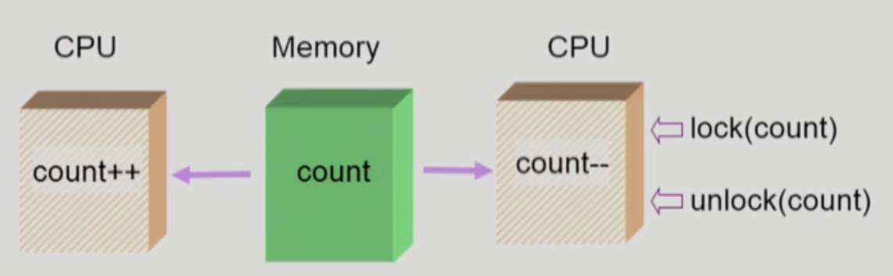
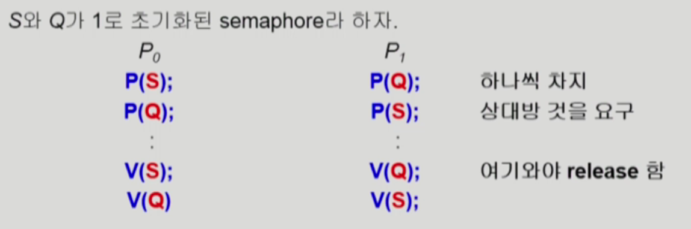

# Process Synchronization

## 데이터의 접근

1. 데이터가 저장된 위치에서 데이터를 읽어온다
2. 해당 데이터를 연산해서 원래 위치에 저장한다.



만약 저장된 위치의 data를 여러 곳에서 사용한다고 하면 **Race Condition**의 가능성이 있다. 

⇒ 동시에 해당 데이터에 접근해서 제대로된 결과값을 반영하지 못하는 것 

✔️ Multiprocesser System일 경우

1. 동일한 데이터를 각 다른 CPU가 접근하는 경우 문제가 생길 수 있다.
2. 공유 메모리를 사용할 경우 여러 개의 프로세스가 한 가지 데이터에 접근할 때 문제가 발생할 수 있다.
3. 커널모드 수행 중 인터럽트로 커널모드 다른 루틴을 수행할 때 문제가 발생할 수 있다.

## OS에서 race condition 발생 시점

1. kernel 수행 중 인터럽트 발생 시
    
    
    
    해결책 : 중요한 변수 값을 건드리는 동안에는 interrupt가 들어와도 interrupt 처리 루틴을 실행하지 않고 작업이 끝난 이후에 실행하면서 race condition 문제가 일어나지 않도록 한다.
    
2. Process가 system call을 하여 kernel mode로 수행 중인데 context switch가 일어나는 경우
    
    
    
    ProcessA가 실행하며 count 변수에 접근했다가, 할당된 시간이 끝나면 Process B로 넘어가 count가 증가하고, 다시 B에 할당된 시간이 끝났을 때 변수에 접근하게 되면 race condition이 발생한다.
    
    해결책: 커널 모드에서 수행 중일 때는 CPU를 preempt하지 않는다. 커널 모드에서 사용자 모드로 돌아갈 때 preempt한다.
    
3. Multiprocessor에서 shared memory 내의 kernel data
    
    
    
    하나의 CPU에서 해당 데이터에 접근할 때 lock을 해놓고, 데이터를 변경한 후, 변경이 끝난 후 unlock을 해서 다시 풀어주는 방식으로 해결한다.
    
    해결책 :
    
    한 번에 하나의 CPU만이 커널에 들어갈 수 있게 하는 방법
    
    커널 내부에 있는 각 공유 데이터에 접근할 때마다 그 데이터에 대한 lock / unlock을 하는 방법
    

## Process Synchronization 문제

공유 데이터(shared data)의 동시 접근은 데이터의 불일치 문제를 발생시킬 수 있다.

일관성 유지를 위해서는 협력 프로세스 간의 실행 순서를 정해주는 메커니즘이 필요하다.

**✔️ Race Condition**

여러 프로세스들이 동시에 공유 데이터를 접근하는 상황

데이터의 최종 연산 결과는 마지막에 그 데이터를 다룬 프로세스에 따라 달라짐

막기 위해서는 동기화가 잘 되어야 함

**⭕️ 해결책**

Critical-Section Problem

공유 데이터에 접근하는 코드인 critical section이 존재하는데, 하나의 프로세스가 critical section에 있을 때 다른 모든 데이터는 critical section에 들어갈 수 없어야 한다.

## 해결 방법들

1. code를 넣어 critical section에 접근하는 방법

```c
do {
	entry section // 실행하기 이전에 lock
	critical section
	exit section // 실행한 이후 unlock
	remainder section
} while (1);
```

## 충족 조건

### Mutual Exclusion

프로세스가 critical section 부분을 수행 중이면 다른 모든 프로세스들은 그들의 critical section에 들어가면 안된다.

### Progress

아무도 critical section에 들어가있지 않은 상태에서 들어가고 싶으면, 들어가게 해주어야 한다.

### Bounded Waiting

critical section에 들어가려고 요청한 후부터 그 요청이 허용될 때까지 다른 프로세스들이 critical section에 들어가는 횟수에 한계가 있어야 한다.

## Algorithm1

```c
do {
	while(turn != 0); /* My turn ? */
	critical section
	turn = 1;         /* Now it's your turn */
	remainder section
} while (1);
```

**❌ 단점**

progress 조건을 만족하지 못한다. 

또한 상대편이 critical section에 들어갔다 나와야만 다른 프로세스가 들어갈 수 있다.

- Algorithm 1은 `turn` 변수를 통해 특정 프로세스에게 교대의 책임을 둠으로써 임계 영역에 대한 접근을 제어하려는 시도입니다. 이 때문에 한 프로세스가 `turn`을 변경하지 않으면 다른 프로세스는 무한히 기다릴 수 있습니다.

## Algorithm2

처음 boolean flag[2], 처음에는 모두 false

```c
do {
	flag[i] = true;
	while(flag[i]);      /* My turn ? */
	critical section
	flag[i] = false;     /* Now it's your turn */
	remainder section
} while (1);
```

**❌ 단점**

둘 다 true가 되면 아무도 들어가지 못하는 상황이 생긴다.

- Algorithm 2는 각 프로세스가 진입하고자 하는 의사를 `flag`로 나타내고, 이를 상대 프로세스가 확인하여 진입 여부를 결정하는 방식을 사용합니다. 따라서 한 프로세스가 진입을 원할 때, 다른 프로세스는 해당 프로세스의 의사를 확인하고 적절히 대응할 수 있습니다.

## Algorithm3 (Peterson’s Algorithm)

```c
do {
	flag[i] = true;
	turn = j;
	while(flag[i] && turn == j);
	critical section
	flag[i] = false;     
	remainder section
} while (1);
```

**앞의 3가지 모든 경우의 수를 충족시킨다.** 

**❌ 단점**

Busy Waiting(=spin lock)! (계속 CPU와 memory를 쓰면서 wait)

## Synchronization Hardware

하드웨어적으로 Test&modify를 atomic하게 수행할 수 있도록 지원하는 경우에는 위의 문제를 간단하게 해결할 수 있다.

대표적으로 Test_and_Set이 있다. a라는 데이터의 현재 값을 읽어내고, 이를 1로 바꿔주는 일을 하나의 instruction으로 처리하는 것 

```c
Synchronization variable:
	boolean lock = false;

do {
	while(Test_and_Set(lock));      /* My turn ? */
	critical section
	lock = false;
	remainder section
} while (1);
```

## Semaphore

추상 자료형이며 두 가지 연산이 존재한다.

정수 변수값을 가질 수 있다. ⇒ 자원의 개수

```c
P(S): while(S <= 0) do no-op; // wait
			S--;
// semaphore 변수값을 획득하는 과정
// lock을 하는 과정
// S값이 음수일때는 아무일도 하지 않다가, 자원을 내어놓는 순간 자원을 가져가 획득한다.
```

```c
V(S): 
			S++;
// semaphore 변수값을 반납하는 과정
// unlock
// 사용을 다 하면 S를 증가하며 반납
```

## Critical Section of n Process

```c
semaphore mutex; // 변수 1로 둔다.

do {
	P(mutex);
	critical section
	V(mutex);
	remainder section
} while (1);
```

**❌ 단점**

Busy Waiting(=spin lock)! (계속 CPU와 memory를 쓰면서 wait)

## Block & Wakeup 방식의 구현 (=sleep lock)

semaphore를 아래와 같이 정의하며 wait queue를 하나 만들어둔다.

```c
typedef struct
{
	int value;         /* sempphore */
	struct process *L; /* process wait queue */
} semaphore;
```

### block

커널은 block을 호출한 프로세스를 suspend 시킴

이 프로세스의 PCB를 semaphore에 대한 wait queue에 넣음

### wakeup(p)

block된 프로세스 P를 wakeup 시킴

이 프로세스의 PCB를 ready queue로 옮김

```c
P(S): S.value--;
			if (S.value < 0) /* 자원이 없어 들어갈 수 없으면 blocked */
			{
				block();
			}
```

```c
V(S): S.value++;
			if (S.value <= 0) /* value를 증가시켰는데도 불구하고 0이하이면 잠들어 있는 프로세스가 있고, 그 프로세스를 깨워줘야 한다는 것을 의미 */
			{
				wakeup(P);
			}
```

## Busy-wait vs Block/Wakeup

Critical Section의 길이가 긴 경우 Block/Wakeup이 적당

Critical Section의 길이가 매우 짧은 경우 Block/Wakeup 오버헤드가 busy-wait 오버헤드보다 더 커질 수 있음

일반적으로는 Block/wakeup 방식이 더 좋음

## 두 가지 Semaphores

### Counting semaphore

도메인이 0 이상인 임의의 정수값

주로 resource counting에 사용

여분의 자원을 Counting 하는 용도이며, 가져다 쓸 수 있음

### Binary semaphore (=mutex)

0 또는 1 값만 가질 수 있는 Semaphore

주로 mutual exclusion (lock/unlock)에 사용

## Deadlock and Starvation

두 가지를 모두 보유해야 두 가지를 모두 사용할 수 있는 것이 Semaphore의 단점



자신의 것은 내어놓지 않고 상대방의 것을 영원히 기다리는 문제가 발생 ⇒ 서로 순서를 동일하게 맞춰주면 가능하다.

### Deadlock

둘 이상의 프로세스가 서로 상대방에 의해 충족될 수 있는 event를 무한히 기다리는 현상

### Starvation

Indefinite blocking: 프로세스가 suspend된 이유에 해당하는 세마포어 큐에서 빠져나갈 수 없는 현상

## Synchronization 문제점들

### 1. Bounded-Buffer Problem(Producer-Consumer Problem)

producer: 공유버퍼에 데이터를 만들어서 넣는 역할

consumer: 공유버퍼에서 데이터를 가져가는 역할

✔️ 데이터를 넣거나 가져가는 역할이 겹칠 수 있음: 둘 모두 데이터가 있는지 없는지 확인하고 Lock을 걸어서 데이터를 조작하고 Lock을 풀어야 한다.

✔️ Shared data: 공유 buffer자체가 데이터가 되고 buffer 조작 변수가 필요하다. (empty/full buffer의 시작 위치) ⇒ lock과 unlock을 위해 Semaphore 변수가 필요함

✔️ 자원의 개수를 counting 하는 용도로 필요

```c
Synchronization variables;
semaphore full= 0, empty = n, mutex = 1; // 내용이 들어있는 개수를 새기 위한 변수, 비어있는 변수, lock을 걸기 위한 변수

// Producer
do {
	P(empty); // 빈 버퍼가 있다면;
	P(mutex);
	
	add X to buffer
	
	V(mutex);
	V(full); // 내용이 들어있는 buffer count++ (full)
} while(1)

// Cousumer
do {
	P(full); 
	P(mutex);
	
	remove an item from buffer to y
	
	V(mutex);
	V(empty);
} while(1)

```

### 2. Reader-Writers Problem

읽는 프로세스와 쓰는 프로세스 두 가지가 있으며, 공유 데이터는 DB라고 함

한 프로세스가 DB에 write 중 일 때 다른 process가 접근하면 안됨 

read는 동시에 해도 됨 !

**⭕️ 해결책**

writer가 DB에 접근 허가를 아직 얻지 못한 상태애서는 모든 대기중인 READER를 다 DB에 접근하게 해준다.

writer는 대기 중인 reader가 하나도 없을 때 접근 가능하다.

일단 writer가 DB에 접근 중이면 reader의 접근이 금지된다.

writer가 DB에서 빠져나가야만 Reader의 접근이 허용된다.

🔖 shared data - DB 자체, readcount : 현재 DB에 접근중인 Reader의 수

🔖 synchronization variables - mutex (공유 변수 readcount를 접근하는 코드의 mutual exclusion 보장을 위해 사용), db

### writer

```c
P(db);
writing DB is performed
V(db);
```

### reader

```c
P(mutex);
readcount++;
if (readcount == 1) P(db); // 처음 읽으러 오면 lock
V(mutex);

reading DB is performed

P(mutex);
readcount--;
if (readcount == 0) V(db); // 마지막으로 읽으러 오면 unlock
V(mutex);
```

### 3. Dining-Philosophers Problem

```c
do {
	P(chopstick[i];
	P(chopstick[(i + 1) % 5);
	
	eat();

	V(chopstick[i]);
	V(chopstick[(i + 1) % 5);

	think()
	
} while(1)
```

❌ 문제점

모두 왼쪽 젓가락을 잡으면 오른쪽 젓가락은 모두 잡을 수 없는 상황이기 때문에 deadlock의 가능성이 있다.

**⭕️ 해결책**

4명의 철학자만이 테이블에 동시에 앉을 수 있도록 한다.

젓가락을 두 개 모두 잡을 수 있을 때에만 젓가락을 잡을 수 있게 한다.

비대칭일 경우 짝수(홀수) 철학자는 왼쪽(오른쪽) 젓가락부터 집도록

## Monitor

동시 수행중인 프로세스 사이에서 abstract data type의 안전한 공유를 보장하기 위한 high-level synchronization construct

lock을 걸 필요가 없다는 것이 semaphore와의 차이점

### Semaphore의 문제점

코딩하기 힘들다.

정확성의 입증이 어렵다.

자발적 협력이 필요하다.

한 번의 실수가 모든 시스템에 치명적 영향

### Monitor 특징

프로세스가 모니터 안에서 기다릴 수 있도록 하기 위해 condition variable 사용 (자원의 개수를 세는 것)

모니터 내에서 하나의 프로세스만 작동할 수 있음

```c
monitor_bounded_buffer
{
	int buffer[N];
	condition full, empty;

	void produce(int x)
	{
		if there is no empty buffer
			empty.wait();
		add x to an empty buffer
		full.signal();	
	}

	void consume(int *x)
	{
		if there is no full buffer
			full.wait();
		remove an item from buffer and store it to *x
		empty.signal();	
	}
}
```