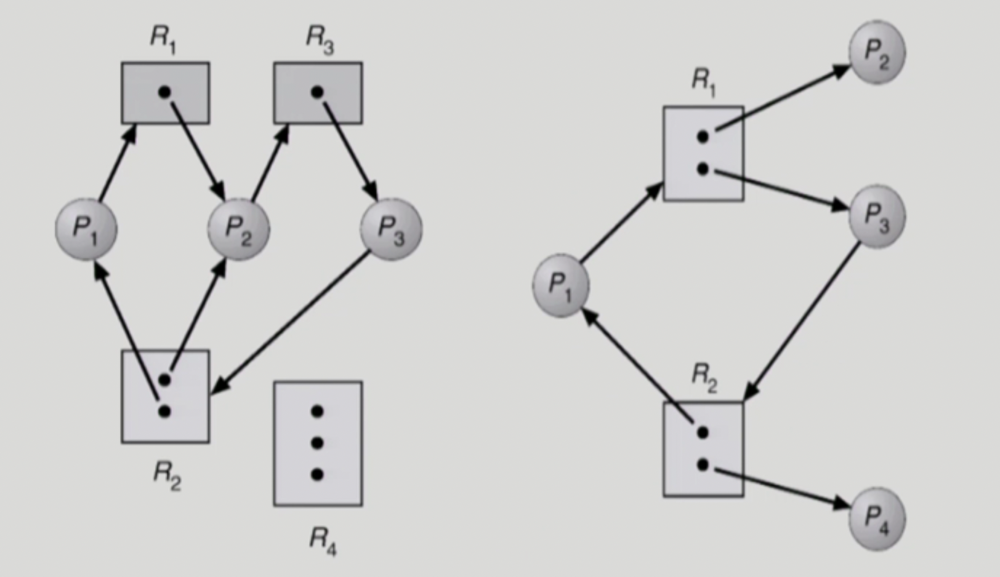
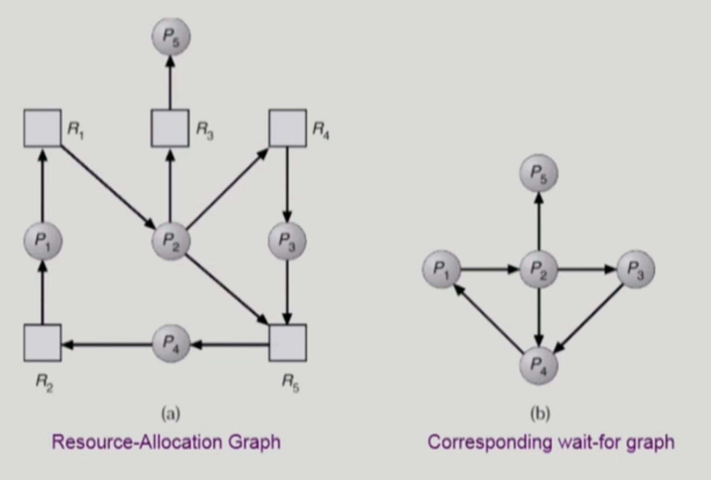

# Deadlock
## Deadlock(교착상태)

일련의 프로세스들이 서로가 가진 자원을 기다리며 block된 상태

### Resource(자원)

하드웨어, 소프트웨어 등을 포함하는 개념 (ex. I/O device, CPU cycle, memory space, semaphore 등)

프로세스가 자원을 사용하는 절차: Request → Allocate → Use → Release

## Deadlock 발생의 4가지 조건

### 1. Mutual exclusion (상호 배제)

매 순간 하나의 프로세스만이 자원을 사용할 수 있음

### 2. No preemption (비선점)

프로세스는 자원을 스스로 내어놓을 뿐 강제로 빼앗기지 않음

### 3. Hold and wait (보유 대기)

자원을 가진 프로세스가 다른 자원을 기다릴 때 보유 자원을 놓지 않고 계속 가지고 있음

### 4. Circular wait (순환 대기)

자원을 기다리는 프로세스 간에 사이클이 형성되어야 함

✔️ 그래프에 cycle이 없으면 deadlock이 아니다.

✔️ 그래프에 cycle이 있으면

자원의 인스턴스 하나씩 밖에 없다면 그것은 데드락을 의미한다. (서로가 원하는 자원을 다른 사람이 가지고 있기 때문에)

자원의 인스턴스가 여러개 있다면 데드락일수도 아닐 수도 있다.

왼쪽의 경우 각자가 필요한 자원을 다른 프로세스들이 가지고 있기 때문에 데드락인 상태이다.

오른쪽의 경우 여분의 자원이 하나씩 더 있고, 여분의 자원을 가지고 있는 프로세스가 데드락인 상태가 아니기 때문에 데드락인 상태가 아니다.

## Deadlock의 처리 방법

### 1. Deadlock Prevention (미연에 방지)

- 자원 할당시 Deadlock의 4가지 필요 조건 중 어느 하나가 만족되지 않도록 하는 것

### 2. Deadlock Avoidance (미연에 방지)

- 자원 요청에 대한 부가적인 정보를 이용해서 deadlock의 가능성이 없는 경우에만 자원을 할당
- 시스템 state가 원래 state로 돌아올 수 없는 경우에만 자원 할당

### 3. Deadlock Detection and recovery

- Deadlock 발생은 허용하되 그에 대한 detection 루틴을 두어 deadlock 발견시 recover

### 4. Deadlock Ignorance

- Deadlock을 시스템이 책임지지 않음
- UNIX를 포함한 대부분의 OS가 채택
- Deadlock은 평소에 잘 발생하지 않기 때문에 이를 위한 방법을 미연에 만들기보다는 무시하는 경우가 많음

## Deadlock Prevention (미연에 방지)

- 자원 할당시 Deadlock의 4가지 필요 조건 중 어느 하나가 만족되지 않도록 하는 것

### 1. Mutual Exclusion ⇒ 배재할 수 있는 조건이 아님

공유해서는 안되는 자원의 경우 반드시 성립해야 함

### 2. Hold and Wait

프로세스가 자원을 요청할 때 다른 어떤 자원도 가지고 있지 않아야 한다.

1. 프로세스 시작 시 모든 필요한 자원을 할당받게 하는 방법 ⇒ 중간에 추가로 요청하는 자원이 없음, 자원의 비효율성이 생길 수 있음
2. 자원이 필요할 경우 보유 자원을 모두 놓고 다시 요청

### 3. No Preemption

프로세스가 어떤 자원을 기다려야 하는 경우 이미 보유한 자원이 선점됨

모든 필요한 자원을 얻을 수 있을 때 그 프로세스는 다시 시작됨

state를 쉽게 save하고 restore할 수 있는 자원에서 주로 사용 (CPU, memory)

### 4. Circular Wait

모든 자원 유형에 할당 순서를 정하여 정해진 순서대로만 자원 할당

예를 들어 순서가 3인 자원 R1을 보유중인 프로세스가 순서가 1인 자원R2를 할당받기 위해서는 우선 R1을 release해야 함

⇒ Utilization 저하, throughput 감소, starvation 문제 발생 가능성

## Deadlock Avoidance (미연에 방지)

시스템이 safe state에 있으면 no deadlock

시스템이 unsafe state에 있으면 possibility of deadlock

최대로 사용할 자원을 declare을 바탕으로 deadlock의 가능성이 있으면 남아있다고 하더라도 자원을 할당하지 않음

### 1. Resource Allocation Graph algorithm

인스턴스가 하나씩 있을 때 (single instance)

### 2. Banker’s Algorithm

인스턴스가 자원 당 여러 개 있을 때 (multiple instance)

가용자원으로 safe sequence가 있어서 safe 상태를 유지하고 있는 것

## Deadlock Detection and recovery

### Detection

1. single instance 인 경우
    1. 자원할당 그래프에서의 cycle이 곧 deadlock을 의미 ⇒ wait for graph
        
        **wait-for-graph**
        
        자원할당 그래프의 변형, 프로세스 만으로 node 구성, Pi가 가지고 있는 자원을 Pk가 기다리는 경우 Pk → Pi라고 표현 가능
        O(n^2) 의 시간이 걸림
        
    
    자원이 하나이기 때문에 왼쪽 그래프를 오른쪽 그래프와 같이 그릴 수 있다.
    
2. multiple instance인 경우
    1. Banker’s algorithm과 유사한 방법 활용

### Recovery

1. Process termination
    
    데드락과 관련된 모두 프로세스는 모두 kill(종료)
    
2. Resoucre Preemption
    
    하나씩 프로세스를 kill 해서 어디서 데드락이 발생되었는지 알아보는 것(자원을 빼앗음)
    
    비용을 최소화할 victim의 선정
    
    safe state로 rollback 하여 process를 restart
    
    - starvation 문제 발생 가능 ⇒ 동일한 프로세스가 계속해서 victim으로 선정되는 경우, cost factor에 rollback 횟수도 같이 고려