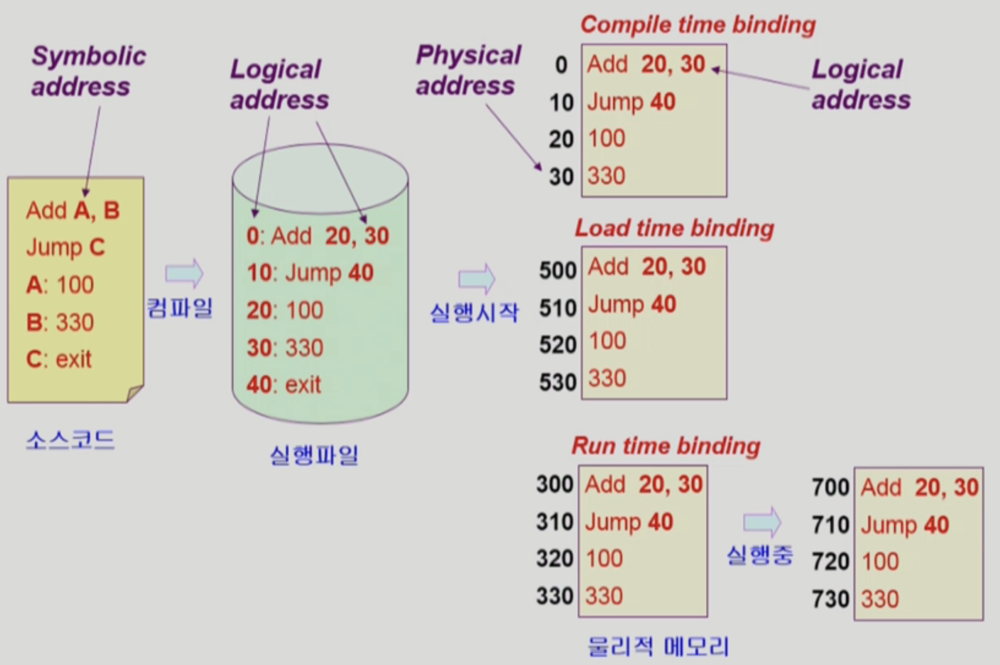

# Memory Management
## Logical address

프로세스마다 독립적으로 가지는 주소공간

각 프로세스마다 0번지부터 시작

**CPU가 보는 주소는 logical address이다**

## Physical address

메모리에 실제 올라가는 위치

## 주소 바인딩

주소를 결정하는 것

Symbolic Address(숫자로 된 주소가 아닌 변수나 함수를 의미) → Logical Address → Physical Address

### ✨ Compile time binding

물리적 메모리 주소(physical address)가 컴파일 시 알려짐

시작 위치 변경시 재 컴파일

컴파일러는 절대 코드(absolute code)생성

컴파일 시 물리적 메모리 주소가 정해지기 때문에 논리적 주소와 물리적 주소가 동일

동적으로 할당하는 것이 아니기 때문에 사용하지 않는 주소에 대해서 비효율적임

현대 운영체제에서는 사용하지 않음

### ✨ Load time binding

Loader의 책임하에 물리적 메모리 주소 부여

컴파일러가 재배치가능코드(relocatable code)를 생성한 경우 가능

컴파일 타임이 아닌 실행파일 실행시 메모리 주소를 부여함

비어있는 메모리 주소가 있을 경우, 거기서부터 메모리 주소값을 부여

### ✨ Execution time binding (=Run time binding)

수행이 시작된 이후에도 프로세스의 메모리 상 위치를 옮길 수 있음

CPU가 주소를 참조할 때마다 binding을 점검 (address mapping table)

하드웨어적인 자원이 필요(MMU)

컴파일 타임이 아닌 실행파일 실행시 메모리 주소를 부여함

실행되는 도중 메모리 주소가 바뀔 수 있음

현대의 OS는 이 방식을 활용

## Memory-Management Unit (MMU)

logical address를 physical address로 매핑해주는 Hardware device

relocation register(base register), limit register 두 개로 주소 변환이 일어남

### MMU scheme

사용자 프로세스가 CPU에서 수행되며 생성해내는 모든 주소값에 대해 base register(=relocation register)의 값을 더한다.

아래 표를 보면 base register는 14000, 생성해내는 논리 주소값은 346으로 물리적 주소는 14346이 된다.

limit register의 역할은 악의적으로 현재 프로그램의 주소값 범위 외에 다른 프로그램이 위치하는 주소를 읽는 것을 막기 위한 것이다.

그래서 limit register 보다 적은지 확인하고 물리적인 주소로 변환하고 있음

### User Program

logical address만을 다룬다.

실제 physical address를 볼 수 없으며 알 필요가 없다.

## 용어

### Dynamic Loading

메모리에 필요할 때마다 동적으로 올리는 것

프로세스 전체를 메모리에 미리 다 올리는 것이 아니라 해당 루틴이 불려질 때 메모리에 load 하는 것

memory utilization의 향상

가끔씩 사용되는 많은 양의 코드의 경우 유용 (예: 오류 처리 루틴)

운영체제의 특별한 지원 없이 프로그램 자체에서 구현 가능 (OS는 라이브러리를 통해 지원 가능)

** 현재 필요한 리소스가 필요할 때마다 동적으로 올라가는 것은 **운영체제의 paging시스템**을 통하기 때문에, 여기의 dynamic loading과는 다른 개념 ⇒ 혼용해서 쓰기는 함

### Overlays

메모리에 프로세스의 부분 중 실제 필요한 정보만을 올림

프로세스의 크기가 메모리보다 클 때 유용

운영체제의 지원 없이 사용자에 의해 구현

작은 공간의 메모리를 사용하던 초창기 시스템에서 수작업으로 프로그래머가 구현

(Dynamic Loading은 라이브러리를 통해 지원하지만, overlays는 수작업이다.)

### Swapping

프로세스를 일시적으로 메모리에서 backing store(swap area = 하드웨어의 일종)로 쫓아내는 것

✔️ Backing Store (=swap area)

디스크 = 많은 사용자의 프로세스 이미지를 담을 만큼 충분히 빠르고 큰 저장공간

✔️ Swap in / Swap out

일반적으로 중기 스케줄러 (swapper)에 의해 swap out 시킬 프로세스 선정

Priority-based CPU scheduling algorithm → priority가 낮은 프로세스를 swapped out 시킴, 높은 프로세스를 메모리에 올려놓음

Compile time binding과 Load time binding의 경우 기존 위치로 다시 swap 되어야 하기 때문에 효율성이 낮음

Execution time binding에서는 추후 빈 메모리 영역 아무 곳에나 올릴 수 있음(=Run time binding이 적용되어야 효율적임)

### Dynamic Linking

Linking을 실행 시간까지 미루는 기법

프로그램이 컴파일되고 로드된 후, 여러 모듈이나 라이브러리를 하나로 통합하여 최종 실행 파일을 생성하는 단계

✔️ Static linking

라이브러리가 프로그램의 실행 파일 코드에 포함됨

실행 파일의 크기가 커짐

동일한 라이브러리를 각각의 프로세스가 메모리에 올리므로 메모리 낭비

✔️ Dynamic linking (= shared library)

라이브러리가 실행시 연결됨

라이브러리 호출 부분에 라이브러리 루틴의 위치를 찾기 위한 stub이라는 작은 코드를 둠

라이브러리가 이미 메모리에 있으면 그 루틴의 주소로 가고 없으면 디스크에서 읽어옴

운영체제의 도움이 필요

## 물리적 메모리의 할당 (Allocation of Physical Memory)

OS 상주영역(낮은 주소)과, 사용자 프로세스 영역(높은 주소 영역)

### 사용자 프로세스 영역

1. Contiguous allocation (연속 할당)
    
    각각의 프로세스가 메모리의 연속적인 공간에 적재되도록 하는 것
    
    주소공간이 연속되는 것을 의미
    
    - Fixed partition allocation
    - Variable partition allocation
2. Noncontiguous allocation(불연속 할당)
    
    하나의 프로세스가 메모리의 여러 영역에 분산되어 올라갈 수 있음
    
    - Paging (프로그램의 주소공간을 같은 크기의 페이지 단위로 잘라서 할당하는 것)
    - Segmentation (프로그램을 의미 단위로 쪼갠 것)
    - Paged Segmentation

### Contiguous Allocation

1. Fixed partition allocation (고정 분할 방식)
    1. 물리적 메모리를 몇 개의 영구적 분할로 나눔
    2. 분할의 크기가 모두 동일한 방식과 서로 다른 방식이 존재
    3. 분할당 하나의 프로그램 적재
    4. 융통성이 없음(동시에 메모리에 load되는 프로그램의 수가 고정됨, 최대 수행 가능 프로그램 크기 제한)
    5. internal fragmentation 발생 (external fragmentation도 발생)
2. Variable partition allocation(가변 분할 방식)
    1. 프로그램의 크기를 고려해서 할당
    2. 분할의 크기, 개수가 동적으로 변함
    3. 기술적 관리 기법 필요
    4. external fragmentation 발생

고정 분할 방식에서 프로그램B는 분할2에 크기 때문에 할당할 수 없기 때문에 분할3에 할당한다.

외부 조각의 경우 프로그램을 할당하지 못해서 생기는 것이고, 내부 조각의 경우 프로그램의 크기가 분할의 크기와 맞지 않아서 생기는 것이다.

가변 분할 또한 프로그램의 크기를 정확하게 맞추기 어렵기 때문에 외부 조각이 생길 수 있다.

### Hole

가용 메모리 공간

다양한 크기의 hole들이 메모리 여러 곳에 흩어져 있음

프로세스가 도착하면 수용 가능한 Hole을 할당

운영체제는 a) 할당 공간, b) 가용 공간 (hole)을 유지 

### Dynamic Storage-Allocation Problem

가변 분할 방식에서 size n인 요청을 만족하는 가장 적절한 hole을 찾는 문제

✨ first-fit(hole을 찾는 overhead가 적음)과 best-fit(가장 적당한 hole을 찾음)이 worst-fit보다 속도와 공간 이용률 측면에서 효과적인 것으로 알려짐

1. First-fit
    
    Size가 n이상인 것 중 최초로 찾아지는 hole에 할당
    
2. Best-fit
    
    Size가 n이상인 가장 작은 hole을 찾아서 할당
    
    Hole의 리스트가 크기순으로 정렬되지 않은 경우 모든 hole의 리스트를 탐색해야 함
    
    많은 수의 아주 작은 hole들이 생성됨
    
3. Worst-fit
    
    가장 큰 hole에 할당
    
    모든 리스트 탐색
    
    상대적으로 아주 큰 hole들이 생성됨
    
4. Compaction
    
    external fragmenation 문제를 해결하는 한 가지 방법
    
    사용 중인 메모리 영역을 한군데로 몰고 hole들을 다른 한 곳으로 몰아 큰 block을 만드는 것
    
    매우 비용이 많이 드는 방법
    
    최소한의 메모리 이동으로 compaction하는 방법(복잡)
    
    프로세스의 주소가 실행 시간에 동적으로 재배치 가능한 경우에만 수행
    

## Noncontiguous Allocation (불연속 할당)

### Paging

프로세스의 virtual memory를 동일한 사이즈의 page(4KB) 단위로 나눔

virtual memory의 내용이 page 단위로 noncontiguous하게 저장됨

일부는 backing storage에, 일부는 physical memory에 저장

✔️ Basic Method

1. Physical memory를 동일한 크기의 frame으로 나눔
2. logical memory를 동일 크기의 page로 나눔 (frame과 같은 크기)
3. 모든 가용 frame들을 관리
4. page table을 사용하여 logical address를 physical address로 변환
5. External fragmentation은 발생 안하지만, Internal fragmentation은 발생

### Page Table

페이지 테이블은 메인 메모리에 상주

**Page-Table Base Register(PTBR)가 page table을 가리킴**

**Page-Table length Register(PTLR)가 테이블 크기를 보관**

⇒ 앞의 register 두 개를 통해 주소 변환하던 것들의 역할이 위처럼 변경된다.

모든 메모리 접근 연산에는 2번의 memory access가 필요

page table(주소변환을 위함) 접근 1번, 실제 data/instruction(실제 메로리 접근) 접근 한 번

### Associative Register / TLB

- 속도 향상을 위해 associative register 혹은 **translation look-aside buffer(TLB = 주소변환을 위한 cache)**라 불리는 고속의 lookup hardware cache 사용
- Parallel search 가능
- page table에 접근하기 전 TLB에 먼저 접근하여 저장되어있다고 하면 주소 변환을 하여 메모리에 한 번만 접근할 수 있음
- TLB는 빈번히 참조되는 entry 몇 개만 참조하고 있음

✔️ Address translation

- page table 중 일부가 associative register 에 보관되어 있음
- 만약 해당 page #가 associative register 에 있는 경우 곧바로 frame #을 얻음
- 그렇지 않은 경우 main memory 에 있는 page table로부터 frame #을 얻음
- TLB는 context switch 때 flush (remove old entries)

### Two-Level Page Table (inner page table, outer page table)

목적: 페이지테이블을 위한 공간이 줄어들기 때문에 사용

현대의 컴퓨터는 address space가 매우 큰 프로그램 지원

- 32 bit address 사용시 : 2^32 (4G)의 주소 공간
    - page size가 4K시 1M개의 page table entry가 필요
    - 각 page entry가 4B시 프로세스당 4M의 page table 필요
    - 그러나 대부분의 프로그램은 4G의 주소 공간 중 지극히 일부분만 사용하므로 page table 공간이 심하게 낭비됨

→ page table 자체를 page로 구성

→ 사용되지 않는 주소 공간에 대한 outer page table의 엔트리 값은 NULL(대응하는 inner page table이 없음)

### Multilevel Paging and Performance

Address space가 커지면 다단계 페이지 테이블 필요

각 단계의 페이지 테이블이 메모리에 존재하므로 logical address의 physical address 변환에 더 많은 메모리 접근 필요

**TLB**를 통해 메모리 접근 시간을 줄일 수 있음

🔖 4단계 페이지 테이블을 사용했을 때, 4번 동안 주소에 접근하고 1번 메모리의 주소를 읽으며 500ns의 시간이 걸리는데, TLB를 통해 접근 시간을 줄일 수 있다. 

⇒ 메모리 접근 시간이 100ns TLB 접근 시간이 20ns이고 TLB hit ratio가 98% 인 경우, effective memory access time = 0.98 * 120(접근가능) + 0.02 * 520(접근 불가능) = 128ns ⇒ 결과적으로 28ns만 소요

### Memory Protection

page table의 각 entry마다 아래의 bit를 둔다.

✔️ Valid(v) / Invalid(i) Bit in a Page Table

valid: 해당 주소의 frame에 그 프로세스를 구성하는 유효한 내용이 있음을 뜻함 (접근 허용)

invalid: 해당 주소의 frame에 유효한 내용이 없음을 뜻함 (접근 불허)

✔️ Protection bit

page에 대한 연산 접근 권한 (read/write/read-only) ⇒ 원래 본인 밖에 접근하지 못하기 때문에 다른 프로세스에 대한 접근 권한을 의미하는 것은 아님

### page table이 큰 이유

모든 process 별로 그 logical address에 대응하는 모든 page에 대해 page table entry가 존재

대응하는 page가 메모리에 있든 아니든 간에 page table에는 entry로 존재

### Inverted Page Table

page frame 하나 당 **page table에 하나의 entry를 둔 것 (system-wide)**

각 page table entry는 각각의 물리적 메모리의 page frame이 담고 있는 내용 표시 (process-id, process의 logical address)

기존에 사용하던 logical memory → page table → physical memory의 순서가 아니라 physical memory → page table → logical memory의 순서이다.

✔️ 단점 : logical address의 p를 알아야 하는데, 그럴 수 없어서 테이블 전체를 탐색해야 함 (공간을 줄일 순 있으나 시간 overhead가 발생)

✔️ 조치 : 병렬적으로 사용할 수 있도록 associative register 사용 ⇒ Expensive

### Shared Page

- Re-entrant Code (= Pure code)
- read-only로 하여 프로세스 간에 하나의 code만 메모리에 올림 (eg. text editors, compilers, window systems)
- shared code는 모든 프로세스의 logical address space에서 동일한 위치에 있어야 함 (동일한 physical address code를 가지고 있는 것은 당연함)

VS

### Private code and data

각 프로세스들은 독자적으로 메모리에 올림

private data는 logical address space의 아무 곳에 와도 무방

공유할 수 있는 코드는 아래처럼 하나만 같은 물리적인 메모리에 올린다. (shared Page)

## Segmentation

프로그램을 의미 단위의 여러 개의 sement로 구분

- 작게는 프로그램을 구성하는 함수 하나하나를 세그먼트로 정의
- 크게는 프로그램 전체를 하나의 세그먼트로 정의 가능
- 일반적으로 code, data, stack 부분이 하나씩의 세그먼트로 정의 됨

### Segmentation Architecture

logical address = segment-number + offset

1. Segment table : base(세그먼트의 physical address 시작지점) + limit(세그먼트의 길이)
2. Segment-table base register(STBR): 물리적 메모리에서의 segment table의 위치 (시작 위치)
3. Segment-table length register(STLR): 프로그램이 사용하는 segment의 수
    1. segment number s is legal if s < STLR
- Protection
    
    각 세그먼트 별로 protection bit가 있음
    
    Each entry: Valid bit = 0 ⇒ illegal segment, Read/Write/Execution 권한 bit
    
- Sharing
    
    **shared segment**
    
    **same segment number**
    
    ✨ segment는 의미 단위이기 때문에 공유(sharing)와 보안(protection)에 있어 paging보다 훨씬 효과적 
    
- Allocation
    
    first fit / best fit
    
    external fragmentation 발생 (paging 기법에서는 이런 일이 없음 - 동일한 크기이기 때문)
    
    ⇒ segment의 길이가 동일하지 않으므로 가변 분할 방식에서와 동일한 문제점들이 발생
    

## Segmentation with paging

pure segmentation과의 차이점

- segment-table entry가 segment의 base address를 가지고 있는 것이 아니라 segment를 구성하는 page table의 base address를 가지고 있음
1. STBR에 segmentation의 시작 주소가 저장된다. (이때 segmentation이 메모리에 직접 접근하는 것이 아님)
2. segmentation이 paging 단위로 나뉘어서 올라간다. ⇒ allocation 문제가 발생하지 않는다.
3. 의미 단위로 구별해야 하는 일은 segment에서 관리한다.
4. segmentation의 주소변환을 하게 되면 page table의 시작 주소가 나온다, segment당 page table이 존재하는 것

