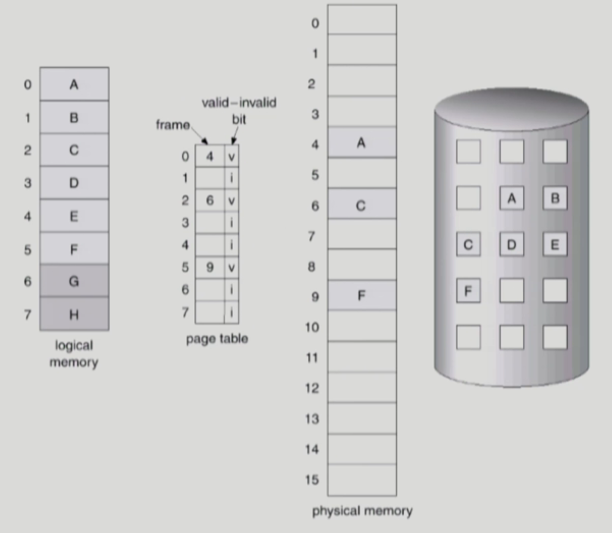
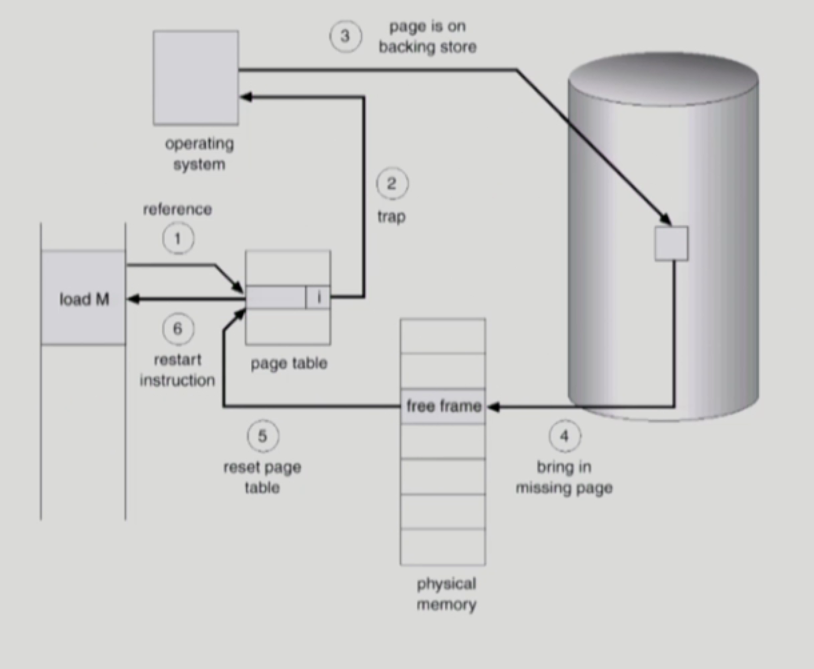
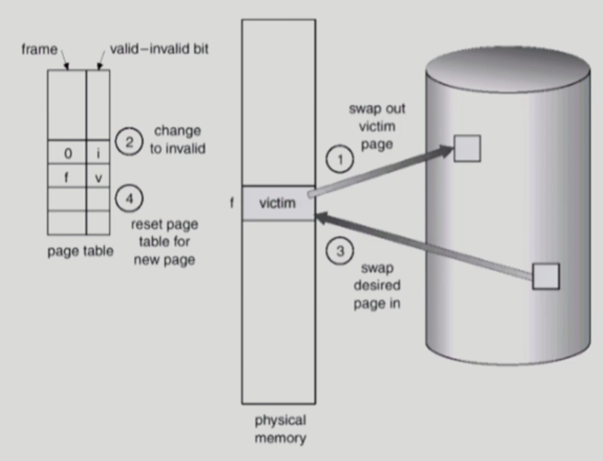
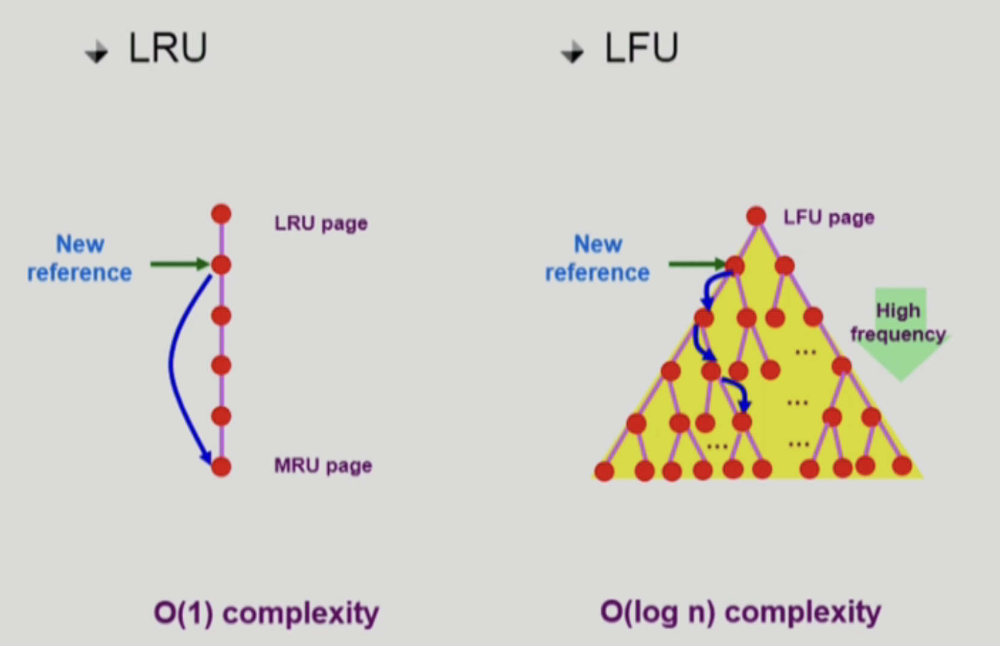

# Virtual Memory

## Demand Paging

(페이징 기법을 사용한다고 가정)

실제로 필요할 때 (실제로 요청이 왔을 때) page를 메모리에 올리는 것

- I/O 양의 감소
- Memory 사용량 감소
- 빠른 응답시간 (한정된 메모리 공간을 더 잘 활용할 수 있기 때문에 I/O 감소 → Memory 사용량 감소)
- 더 많은 사용자 수용

여기서 6번과 7번의 경우 사용되지 않는 주소이기 때문에 invalid로 표시되어 있고, 나머지의 경우 페이지가 물리적인 메모리에 올라와 있지 않고 디스크에 존재하면 invalid로 표시된다.

- Invalid bit의 의미
    - 사용되지 않는 주소 영역인 경우
    - 페이지가 물리적 메모리에 없는 경우
- 처음에는 모든 page entry가 invalid로 초기화
- address translation(주소변환)시에 invalid bit이 set되어 있으면 ⇒ **“page fault” (요청한 페이지가 메모리에 없을 때 ⇒ CPU는 자동적으로 운영체제에 넘어가게 됨 - 일종의 software interrupt)**

## Page fault

invalid page에 접근하면 MMU가 trap을 발생시킴 (page fault trap)

CPU가 운영체제로 넘어가며 Kernal mode로 들어가서 page fault handler가 invoke됨

1. Invalid reference ? (eg. bad address, protection violation ) ⇒ abort process
2. Get an empty page frame (없으면 뺏어온다: replace)
3. 해당 페이지를 disk에서 memory로 읽어온다.
    1. disk I/O가 끝나기까지 page fault 난 프로세스는 CPU를 preempt당함 (block)
    2. disk에 페이지를 읽어오라고 disk controler에 지시
    3. Disk read가 끝나면 page tables entry 기록, valid/invalid bit = “valid”
    4. ready queue에 process를 insert → dispatch later
4. 이 프로세스가 CPU를 잡고 다시 running
5. 아까 중단되었던 instruction을 재개

## Free Frame이 없는 경우 (빈 페이지가 없는 경우)

### Page replacement

어떤 frame을 빼앗아올지 결정해야 함

곧바로 사용되지 않을 page를 쫓아내는 것이 좋음

동일한 페이지가 여러 번 메모리에서 쫓겨났다가 다시 들어올 수 있음

### Replacement Algorithm

page fault rate을 최소화 하는 것이 목표

### Optimal Algorithm

- page fault가 가장 적게 되는 알고리즘
- MIN(OPT): 미래에 참조되는 페이지들을 미리 다 안다고 가정하고 가장 먼 미래에 참조되는 page를 replace
- 미래의 참조를 어떻게 아는가 ? Offline algorithm → 그래서 offline optimal algorithm이라고 함
- 실제 시스템에서 사용하는 것은 불가능
- 다른 알고리즘의 성능에 대한 upper bound 제공
    
    ⇒ Belady’s optimal algorithm, MIN, OPT라는 이름으로 활용
    

### FIFO (First In First Out) Algorithm

FIFO: 먼저 들어온 것을 먼저 내쫓음

단점 : FIFO Anomaly ⇒ 메모리가 많아지면 많아질수록 page fault가 늘어난다.

### LRU (Least Recently Used) Algorithm

가장 오래 전에 참조된 것들을 지움

O(1) 복잡성⇒ Replace할 때 비교할 필요가 없음 (가장 적게 참조된 것을 가장 위에 놓으면 됨)

### LFU (Least Frequently Used) Algorithm

참조 횟수가 가장 적은 페이지를 지움

O(log n) 복잡성

- 최저 참조 횟수인 page가 여럿 있는 경우
    - LFU 알고리즘 자체에서는 여러 page 중 임의로 선정
    - 성능 향상을 위해 가장 오래 전에 참조된 page를 지우게 구현할 수도 있다.
- 장단점
    - LRU처럼 직전 참조 시점만 보는 것이 아니라 장기적인 시간 규모를 보기 때문에 page의 인기도를 좀 더 정확히 반영할 수 있음
    - 참조 시점의 최근성을 반영하지 못함
    - LRU보다 구현이 복잡함

## cacheing 환경

### 캐싱기법

한정된 빠른 공간 (=캐쉬)에 요청된 데이터를 저장해 두었다가 후속 요청시 캐쉬로부터 직접 서비스 하는 방식

paging system외에도 cache memory, buffer caching, Web caching 등 다양한 분야에서 사용

### 시간 제약

교체 알고리즘에서 삭제할 항목을 결정하는 일에 지나치게 많은 시간이 걸리는 경우 실제 시스템에서 사용할 수 없음

Buffer caching이나 Web caching의 경우, O(1)에서 O(log n) 정도까지 허용

Paging System의 경우

- page fault인 경우에만 OS가 관여함(메모리에 없어서 page fault가 나야 운영체제에게 CPU 제어권이 넘어가기 때문이다.)
- 페이지가 이미 메모리에 존재하는 경우 참조시각 등의 정보를 OS가 알 수 없음
- O(1)인 LRU의 list 조작조차 불가능

## Clock Algorithm

LRU의 근사 알고리즘

Second chance algorithm, NUR(Not Used Recently) 또는 NRU(Not Recently Used)라고 불림

1. Reference bit(하드웨어에서 관리)을 사용해서 교체 대상 페이지 선정 (circular list)
2. reference bit가 0인 것을 찾을 때까지 포인터를 하나씩 앞으로 이동
3. 이동하는 중에 reference bit 1은 모두 0으로 변경 
4. reference bit이 0인 것을 찾으면 그 페이지를 교체
5. 한 바퀴 되돌아와서도 (=second change) 0이면 그때에는 replace 당함
6. 자주 사용되는 페이지라면 second change가 올 때 1

### 개선

- reference bit과 modified bit (dirty bit)을 함께 활용
- reference bit = 1 : 최근에 참조된 페이지
- modified bit = 1 : (메모리에 올라온 이후로 I/O가 발생한 적이 있고, CPU에서 변경 사항을 반영해줘야 함)
    
    modified bit이 0인 것을 교체하면 조금 더 빠르게 교체할 수 있다.
    

## Page Frame의 Allocation

Allocation problem : 각 process에 얼마만큼의 page frame을 할당할 것인가 ?

### Allocation의 필요성

- 메모리 참조 명령어 수행시 명령어, 데이터 등 여러 페이지 동시 참조
    - 명령어 수행을 위해 최소한 할당되어야 하는 frame의 수가 있음
- loop을 구성하는 page들은 한꺼번에 allocate 되는 것이 유리함
    - 최소한의 allocation이 없으면 매 loop 마다 page fault

### Allocation Scheme

- Equal allocation: 모든 프로세스에 똑같은 개수 할당
- Proportional allocation: 프로세스 크기에 비례하여 할당
- Priority allocation: 프로세스의 priority에 따라 다르게 할당

## Global vs Local Replacement

### Global replacement

- Replace시 다른 process에 할당된 frame을 빼앗아 올 수 있다.
- Process별 할당량을 조절하는 또 다른 방법
- FIFO, LRU, LFU 등의 알고리즘을 global replacement로 사용시에 해당
- Working set, PFF 알고리즘 사용

### Local replacement

자신에게 할당된 frame 내에서만 replacement

FIFO, LRU, LFU 등의 알고리즘을 process 별로 운영할 때 사용

## Thrashing

프로세스의 원활한 수행에 필요한 최소한의 page frame 수를 할당 받지 못한 경우 발생

1. page fault rate이 매우 높아짐
2. CPU utilization이 낮아짐
3. OS는 MPD(Multiprogramming degree)를 높여야 한다고 판단
4. 또 다른 프로세스가 시스템에 추가됨 (higher MPD)
5. 프로세스당 할당된 frame의 수가 더욱 감소
6. 프로세스는 page의 swap in / swap out으로 매우 바쁨
7. 대부분의 시간에 CPU는 한가함
8. low throughput

⇒ degree of multiprogramming을 조절(동시에 올라가는 프로세스의 개수 조절)

## Working-Set Model

### Locality of reference

- 프로세스는 특정 시간 동안 일정 장소만을 집중적으로 참조한다. (만약 loop를 돈다면 loop를 도는 페이지만을 집중해서 참조하게 함)
- 집중적으로 참조되는 해당 page들의 집합을 locality set (working-set)이라 함

### Working-set Model

- Locality에 기반하여 프로세스가 일정 시간 동안 원활하게 수행되기 위해 **한꺼번에 메모리에 올라와 있어야 하는 page들의 집합을 working set**이라 정의
- Working set 모델에서는 process의 **working set 전체가 메모리에 올라와 있어야 수행되고 그렇지 않을 경우 모든 frame을 반납한 후 swap out(suspend)함**
- Thrasing을 방지함
- Multiprogramming degree를 결정함

### Working-Set Algorithm

- process들의 working set size의 합이 page frame의 수보다 큰 경우
    - 일부 process를 swap out 시켜 남은 process의 working set을 우선적으로 충족시켜 준다. (MPD를 줄임)
- Working set을 다 할당하고도 page frame이 남는 경우
    - Swap out 되었던 프로세스에게 working set을 할당 (MPD를 키움)

### Window size

- Working set을 제대로 탐지하기 위해서는 window size를 잘 결정해야 함
- 값이 너무 작으면 locality set을 모두 수용하지 못할 우려
- 값이 너무 크면 여러 규모의 locality set 수용
- 값이 무한대면 전체 프로그램을 구성하는 page를 working set으로 간주

## PFF(Page-Fault Frequency) Scheme

- page-fault rate의 상한값과 하한값을 둔다.
    - Page fault rate이 상한값을 넘으면 frame을 더 할당
    - page fault rate이 하한값 이하이면 할당 frame 수를 줄임
- 빈 frame이 없으면 일부 프로세스를 swap out